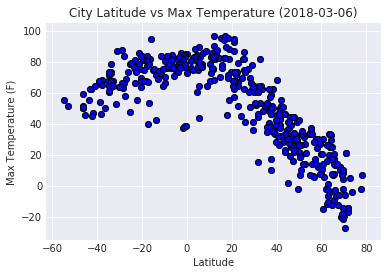
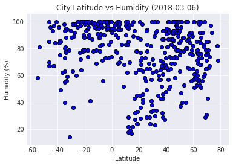
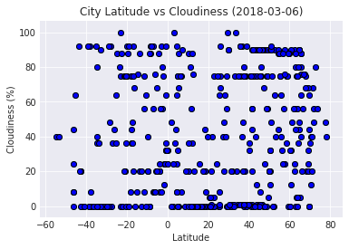
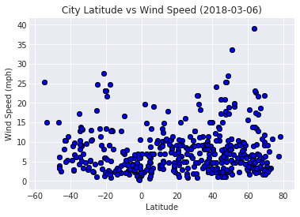

# WeatherPy


```python
import matplotlib.pyplot as plt
import seaborn as sns
import requests
import pandas as pd
import numpy as np
import json
import openweathermapy.core as owm
from datetime import datetime
from citipy import citipy
from pprint import pprint
from owm_config import api_key
```

## Generate Cities List


```python
# Create empty data frame and add columns for city, country, latitude and longitude
cities_list = pd.DataFrame()
cities_list["City"] = ""
cities_list["Country"] = ""
# Randomly generate numbers for latitude and longitude and loop through 500 times
cities_list["Latitude"] = [np.random.uniform(-90, 90) for x in range(1500)]
cities_list["Longitude"] = [np.random.uniform(-180, 180) for x in range(1500)]
# Use latitude and longitude to find city and country by using interrows and citipy
for index, row in cities_list.iterrows():
    lat = row["Latitude"]
    lng = row["Longitude"]
    cities_list.set_value(index, "City", citipy.nearest_city(lat, lng).city_name)
    cities_list.set_value(index, "Country", citipy.nearest_city(lat, lng).country_code)
# Delete any possible duplicate cities and reset index
cities_list = cities_list.drop_duplicates(["City", "Country"])
cities_list = cities_list.reset_index()
# Update data frame to just city and country column
cities_list = cities_list[["City", "Country"]]
cities_list = cities_list.iloc[:500]
cities_list
```


<div>
<style>
    .dataframe thead tr:only-child th {
        text-align: right;
    }

    .dataframe thead th {
        text-align: left;
    }

    .dataframe tbody tr th {
        vertical-align: top;
    }
</style>
<table border="1" class="dataframe">
  <thead>
    <tr style="text-align: right;">
      <th></th>
      <th>City</th>
      <th>Country</th>
    </tr>
  </thead>
  <tbody>
    <tr>
      <th>0</th>
      <td>yellowknife</td>
      <td>ca</td>
    </tr>
    <tr>
      <th>1</th>
      <td>atuona</td>
      <td>pf</td>
    </tr>
    <tr>
      <th>2</th>
      <td>manaure</td>
      <td>co</td>
    </tr>
    <tr>
      <th>3</th>
      <td>ancud</td>
      <td>cl</td>
    </tr>
    <tr>
      <th>4</th>
      <td>fare</td>
      <td>pf</td>
    </tr>
    <tr>
      <th>5</th>
      <td>cabo san lucas</td>
      <td>mx</td>
    </tr>
    <tr>
      <th>6</th>
      <td>caceres</td>
      <td>br</td>
    </tr>
    <tr>
      <th>7</th>
      <td>sola</td>
      <td>vu</td>
    </tr>
    <tr>
      <th>8</th>
      <td>bethel</td>
      <td>us</td>
    </tr>
    <tr>
      <th>9</th>
      <td>port elizabeth</td>
      <td>za</td>
    </tr>
    <tr>
      <th>10</th>
      <td>grand river south east</td>
      <td>mu</td>
    </tr>
    <tr>
      <th>11</th>
      <td>xining</td>
      <td>cn</td>
    </tr>
    <tr>
      <th>12</th>
      <td>tiksi</td>
      <td>ru</td>
    </tr>
    <tr>
      <th>13</th>
      <td>albany</td>
      <td>au</td>
    </tr>
    <tr>
      <th>14</th>
      <td>ushuaia</td>
      <td>ar</td>
    </tr>
    <tr>
      <th>15</th>
      <td>pevek</td>
      <td>ru</td>
    </tr>
    <tr>
      <th>16</th>
      <td>kapaa</td>
      <td>us</td>
    </tr>
    <tr>
      <th>17</th>
      <td>pio xii</td>
      <td>br</td>
    </tr>
    <tr>
      <th>18</th>
      <td>ahipara</td>
      <td>nz</td>
    </tr>
    <tr>
      <th>19</th>
      <td>bessemer</td>
      <td>us</td>
    </tr>
    <tr>
      <th>20</th>
      <td>tsihombe</td>
      <td>mg</td>
    </tr>
    <tr>
      <th>21</th>
      <td>jumla</td>
      <td>np</td>
    </tr>
    <tr>
      <th>22</th>
      <td>wanning</td>
      <td>cn</td>
    </tr>
    <tr>
      <th>23</th>
      <td>clyde river</td>
      <td>ca</td>
    </tr>
    <tr>
      <th>24</th>
      <td>pangody</td>
      <td>ru</td>
    </tr>
    <tr>
      <th>25</th>
      <td>nizhneyansk</td>
      <td>ru</td>
    </tr>
    <tr>
      <th>26</th>
      <td>east london</td>
      <td>za</td>
    </tr>
    <tr>
      <th>27</th>
      <td>mataura</td>
      <td>pf</td>
    </tr>
    <tr>
      <th>28</th>
      <td>mar del plata</td>
      <td>ar</td>
    </tr>
    <tr>
      <th>29</th>
      <td>lotoshino</td>
      <td>ru</td>
    </tr>
    <tr>
      <th>...</th>
      <td>...</td>
      <td>...</td>
    </tr>
    <tr>
      <th>470</th>
      <td>santa maria</td>
      <td>cv</td>
    </tr>
    <tr>
      <th>471</th>
      <td>green valley</td>
      <td>us</td>
    </tr>
    <tr>
      <th>472</th>
      <td>port-cartier</td>
      <td>ca</td>
    </tr>
    <tr>
      <th>473</th>
      <td>kushima</td>
      <td>jp</td>
    </tr>
    <tr>
      <th>474</th>
      <td>dedovichi</td>
      <td>ru</td>
    </tr>
    <tr>
      <th>475</th>
      <td>yefira</td>
      <td>gr</td>
    </tr>
    <tr>
      <th>476</th>
      <td>margate</td>
      <td>za</td>
    </tr>
    <tr>
      <th>477</th>
      <td>homestead</td>
      <td>us</td>
    </tr>
    <tr>
      <th>478</th>
      <td>santo antonio do ica</td>
      <td>br</td>
    </tr>
    <tr>
      <th>479</th>
      <td>alberton</td>
      <td>ca</td>
    </tr>
    <tr>
      <th>480</th>
      <td>nanortalik</td>
      <td>gl</td>
    </tr>
    <tr>
      <th>481</th>
      <td>santa rosa</td>
      <td>ar</td>
    </tr>
    <tr>
      <th>482</th>
      <td>vardo</td>
      <td>no</td>
    </tr>
    <tr>
      <th>483</th>
      <td>palmer</td>
      <td>us</td>
    </tr>
    <tr>
      <th>484</th>
      <td>goderich</td>
      <td>sl</td>
    </tr>
    <tr>
      <th>485</th>
      <td>seymchan</td>
      <td>ru</td>
    </tr>
    <tr>
      <th>486</th>
      <td>okato</td>
      <td>nz</td>
    </tr>
    <tr>
      <th>487</th>
      <td>aflu</td>
      <td>dz</td>
    </tr>
    <tr>
      <th>488</th>
      <td>yar-sale</td>
      <td>ru</td>
    </tr>
    <tr>
      <th>489</th>
      <td>banda aceh</td>
      <td>id</td>
    </tr>
    <tr>
      <th>490</th>
      <td>kalemie</td>
      <td>cd</td>
    </tr>
    <tr>
      <th>491</th>
      <td>paratinga</td>
      <td>br</td>
    </tr>
    <tr>
      <th>492</th>
      <td>solnechnyy</td>
      <td>ru</td>
    </tr>
    <tr>
      <th>493</th>
      <td>cabra</td>
      <td>ph</td>
    </tr>
    <tr>
      <th>494</th>
      <td>cortez</td>
      <td>us</td>
    </tr>
    <tr>
      <th>495</th>
      <td>honningsvag</td>
      <td>no</td>
    </tr>
    <tr>
      <th>496</th>
      <td>tsumeb</td>
      <td>na</td>
    </tr>
    <tr>
      <th>497</th>
      <td>bairiki</td>
      <td>ki</td>
    </tr>
    <tr>
      <th>498</th>
      <td>saint paul</td>
      <td>ca</td>
    </tr>
    <tr>
      <th>499</th>
      <td>tromso</td>
      <td>no</td>
    </tr>
  </tbody>
</table>
<p>500 rows × 2 columns</p>
</div>


## Perform API Calls


```python
# Perform API calls and display results in Data Frame
cities_list["Cloudiness"] = ""
cities_list["Date"] = ""
cities_list["Humidity"] = ""
cities_list["Latitude"] = ""
cities_list["Longitude"] = ""
cities_list["Max Temperature"] = ""
cities_list["Wind Speed"] = ""

# Create row counter and set it to one
row_counter = 1
# Create a dictionary with parameters
settings = {"appid": api_key, "units": "imperial"}
# Create a base url
base_url = "http://api.openweathermap.org/data/2.5/weather?"
# Create query url
query_url = f"{base_url}appid={settings['appid']}&units={settings['units']}&q="

print("Beginning Data Retrieval")
print("---------------------------")
# Iterrows in to loop city row in query url
for index, row in cities_list.iterrows():
    try:
        cities_response = requests.get(query_url + row["City"] + "," + row["Country"])
        print(f"Processing Record {row_counter} | {row['City']}, {row['Country']}")
        print(cities_response.url)
        # Update row counter
        row_counter += 1
    
        # Turn cities response into json with owm module
        cities_response = owm.get_current(row["City"], **settings)
    
        # Create summary variables to retrieve certain data from cities response
        lat_summary = ["coord.lat"]
        lon_summary = ["coord.lon"]
        temp_summary = ["main.temp_max"]
        humidity_summary = ["main.humidity"]
        cloud_summary = ["clouds.all"]
        wind_summary = ["wind.speed"]
        date_summary = ["dt"]
    
        # Add retrieved data into cities_list data frame
        cities_list.set_value(index, "Cloudiness", cities_response(*cloud_summary))
        cities_list.set_value(index, "Date", cities_response(*date_summary))
        cities_list.set_value(index, "Humidity", cities_response(*humidity_summary))
        cities_list.set_value(index, "Latitude", cities_response(*lat_summary))
        cities_list.set_value(index, "Longitude", cities_response(*lon_summary))
        cities_list.set_value(index, "Max Temperature", cities_response(*temp_summary))
        cities_list.set_value(index, "Wind Speed", cities_response(*wind_summary))
    except:
        print(f"**Weather data does not exist for {row['City']}, {row['Country']}**")
        continue
    
print("---------------------------")
print("Data Retrieval Complete")
print("---------------------------")

```

    Beginning Data Retrieval
    ---------------------------
    Processing Record 1 | yellowknife, ca
    http://api.openweathermap.org/data/2.5/weather?appid=bc077df1e512a26037948a356f243d3d&units=imperial&q=yellowknife,ca
    Processing Record 2 | atuona, pf
    http://api.openweathermap.org/data/2.5/weather?appid=bc077df1e512a26037948a356f243d3d&units=imperial&q=atuona,pf
    Processing Record 3 | manaure, co
    http://api.openweathermap.org/data/2.5/weather?appid=bc077df1e512a26037948a356f243d3d&units=imperial&q=manaure,co
    Processing Record 4 | ancud, cl
    http://api.openweathermap.org/data/2.5/weather?appid=bc077df1e512a26037948a356f243d3d&units=imperial&q=ancud,cl
    Processing Record 5 | fare, pf
    http://api.openweathermap.org/data/2.5/weather?appid=bc077df1e512a26037948a356f243d3d&units=imperial&q=fare,pf
    Processing Record 6 | cabo san lucas, mx
    http://api.openweathermap.org/data/2.5/weather?appid=bc077df1e512a26037948a356f243d3d&units=imperial&q=cabo%20san%20lucas,mx
    Processing Record 7 | caceres, br
    http://api.openweathermap.org/data/2.5/weather?appid=bc077df1e512a26037948a356f243d3d&units=imperial&q=caceres,br
    Processing Record 8 | sola, vu
    http://api.openweathermap.org/data/2.5/weather?appid=bc077df1e512a26037948a356f243d3d&units=imperial&q=sola,vu
    Processing Record 9 | bethel, us
    http://api.openweathermap.org/data/2.5/weather?appid=bc077df1e512a26037948a356f243d3d&units=imperial&q=bethel,us
    Processing Record 10 | port elizabeth, za
    http://api.openweathermap.org/data/2.5/weather?appid=bc077df1e512a26037948a356f243d3d&units=imperial&q=port%20elizabeth,za
    Processing Record 11 | grand river south east, mu
    http://api.openweathermap.org/data/2.5/weather?appid=bc077df1e512a26037948a356f243d3d&units=imperial&q=grand%20river%20south%20east,mu
    **Weather data does not exist for grand river south east, mu**
    Processing Record 12 | xining, cn
    http://api.openweathermap.org/data/2.5/weather?appid=bc077df1e512a26037948a356f243d3d&units=imperial&q=xining,cn
    Processing Record 13 | tiksi, ru
    http://api.openweathermap.org/data/2.5/weather?appid=bc077df1e512a26037948a356f243d3d&units=imperial&q=tiksi,ru
    Processing Record 14 | albany, au
    http://api.openweathermap.org/data/2.5/weather?appid=bc077df1e512a26037948a356f243d3d&units=imperial&q=albany,au
    Processing Record 15 | ushuaia, ar
    http://api.openweathermap.org/data/2.5/weather?appid=bc077df1e512a26037948a356f243d3d&units=imperial&q=ushuaia,ar
    Processing Record 16 | pevek, ru
    http://api.openweathermap.org/data/2.5/weather?appid=bc077df1e512a26037948a356f243d3d&units=imperial&q=pevek,ru
    Processing Record 17 | kapaa, us
    http://api.openweathermap.org/data/2.5/weather?appid=bc077df1e512a26037948a356f243d3d&units=imperial&q=kapaa,us
    Processing Record 18 | pio xii, br
    http://api.openweathermap.org/data/2.5/weather?appid=bc077df1e512a26037948a356f243d3d&units=imperial&q=pio%20xii,br
    Processing Record 19 | ahipara, nz
    http://api.openweathermap.org/data/2.5/weather?appid=bc077df1e512a26037948a356f243d3d&units=imperial&q=ahipara,nz
    Processing Record 20 | bessemer, us
    http://api.openweathermap.org/data/2.5/weather?appid=bc077df1e512a26037948a356f243d3d&units=imperial&q=bessemer,us
    Processing Record 21 | tsihombe, mg
    http://api.openweathermap.org/data/2.5/weather?appid=bc077df1e512a26037948a356f243d3d&units=imperial&q=tsihombe,mg
    **Weather data does not exist for tsihombe, mg**
    Processing Record 22 | jumla, np
    http://api.openweathermap.org/data/2.5/weather?appid=bc077df1e512a26037948a356f243d3d&units=imperial&q=jumla,np
    Processing Record 23 | wanning, cn
    http://api.openweathermap.org/data/2.5/weather?appid=bc077df1e512a26037948a356f243d3d&units=imperial&q=wanning,cn
    Processing Record 24 | clyde river, ca
    http://api.openweathermap.org/data/2.5/weather?appid=bc077df1e512a26037948a356f243d3d&units=imperial&q=clyde%20river,ca
    Processing Record 25 | pangody, ru
    http://api.openweathermap.org/data/2.5/weather?appid=bc077df1e512a26037948a356f243d3d&units=imperial&q=pangody,ru
    Processing Record 26 | nizhneyansk, ru
    http://api.openweathermap.org/data/2.5/weather?appid=bc077df1e512a26037948a356f243d3d&units=imperial&q=nizhneyansk,ru
    **Weather data does not exist for nizhneyansk, ru**
    Processing Record 27 | east london, za
    http://api.openweathermap.org/data/2.5/weather?appid=bc077df1e512a26037948a356f243d3d&units=imperial&q=east%20london,za
    Processing Record 28 | mataura, pf
    http://api.openweathermap.org/data/2.5/weather?appid=bc077df1e512a26037948a356f243d3d&units=imperial&q=mataura,pf
    Processing Record 29 | mar del plata, ar
    http://api.openweathermap.org/data/2.5/weather?appid=bc077df1e512a26037948a356f243d3d&units=imperial&q=mar%20del%20plata,ar
    Processing Record 30 | lotoshino, ru
    http://api.openweathermap.org/data/2.5/weather?appid=bc077df1e512a26037948a356f243d3d&units=imperial&q=lotoshino,ru
    Processing Record 31 | bangassou, cf
    http://api.openweathermap.org/data/2.5/weather?appid=bc077df1e512a26037948a356f243d3d&units=imperial&q=bangassou,cf
    Processing Record 32 | bambous virieux, mu
    http://api.openweathermap.org/data/2.5/weather?appid=bc077df1e512a26037948a356f243d3d&units=imperial&q=bambous%20virieux,mu
    Processing Record 33 | arraial do cabo, br
    http://api.openweathermap.org/data/2.5/weather?appid=bc077df1e512a26037948a356f243d3d&units=imperial&q=arraial%20do%20cabo,br
    Processing Record 34 | hilo, us
    http://api.openweathermap.org/data/2.5/weather?appid=bc077df1e512a26037948a356f243d3d&units=imperial&q=hilo,us
    Processing Record 35 | isangel, vu
    http://api.openweathermap.org/data/2.5/weather?appid=bc077df1e512a26037948a356f243d3d&units=imperial&q=isangel,vu
    Processing Record 36 | kloulklubed, pw
    http://api.openweathermap.org/data/2.5/weather?appid=bc077df1e512a26037948a356f243d3d&units=imperial&q=kloulklubed,pw
    Processing Record 37 | walvis bay, na
    http://api.openweathermap.org/data/2.5/weather?appid=bc077df1e512a26037948a356f243d3d&units=imperial&q=walvis%20bay,na
    Processing Record 38 | kostino, ru
    http://api.openweathermap.org/data/2.5/weather?appid=bc077df1e512a26037948a356f243d3d&units=imperial&q=kostino,ru
    Processing Record 39 | bengkulu, id
    http://api.openweathermap.org/data/2.5/weather?appid=bc077df1e512a26037948a356f243d3d&units=imperial&q=bengkulu,id
    **Weather data does not exist for bengkulu, id**
    Processing Record 40 | rikitea, pf
    http://api.openweathermap.org/data/2.5/weather?appid=bc077df1e512a26037948a356f243d3d&units=imperial&q=rikitea,pf
    Processing Record 41 | busselton, au
    http://api.openweathermap.org/data/2.5/weather?appid=bc077df1e512a26037948a356f243d3d&units=imperial&q=busselton,au
    Processing Record 42 | punta arenas, cl
    http://api.openweathermap.org/data/2.5/weather?appid=bc077df1e512a26037948a356f243d3d&units=imperial&q=punta%20arenas,cl
    Processing Record 43 | butaritari, ki
    http://api.openweathermap.org/data/2.5/weather?appid=bc077df1e512a26037948a356f243d3d&units=imperial&q=butaritari,ki
    Processing Record 44 | taoudenni, ml
    http://api.openweathermap.org/data/2.5/weather?appid=bc077df1e512a26037948a356f243d3d&units=imperial&q=taoudenni,ml
    Processing Record 45 | oranjemund, na
    http://api.openweathermap.org/data/2.5/weather?appid=bc077df1e512a26037948a356f243d3d&units=imperial&q=oranjemund,na
    Processing Record 46 | igrim, ru
    http://api.openweathermap.org/data/2.5/weather?appid=bc077df1e512a26037948a356f243d3d&units=imperial&q=igrim,ru
    Processing Record 47 | razole, in
    http://api.openweathermap.org/data/2.5/weather?appid=bc077df1e512a26037948a356f243d3d&units=imperial&q=razole,in
    Processing Record 48 | bluff, nz
    http://api.openweathermap.org/data/2.5/weather?appid=bc077df1e512a26037948a356f243d3d&units=imperial&q=bluff,nz
    Processing Record 49 | orocue, co
    http://api.openweathermap.org/data/2.5/weather?appid=bc077df1e512a26037948a356f243d3d&units=imperial&q=orocue,co
    Processing Record 50 | vila, vu
    http://api.openweathermap.org/data/2.5/weather?appid=bc077df1e512a26037948a356f243d3d&units=imperial&q=vila,vu
    Processing Record 51 | srandakan, id
    http://api.openweathermap.org/data/2.5/weather?appid=bc077df1e512a26037948a356f243d3d&units=imperial&q=srandakan,id
    Processing Record 52 | bredasdorp, za
    http://api.openweathermap.org/data/2.5/weather?appid=bc077df1e512a26037948a356f243d3d&units=imperial&q=bredasdorp,za
    Processing Record 53 | vaini, to
    http://api.openweathermap.org/data/2.5/weather?appid=bc077df1e512a26037948a356f243d3d&units=imperial&q=vaini,to
    Processing Record 54 | konevo, ru
    http://api.openweathermap.org/data/2.5/weather?appid=bc077df1e512a26037948a356f243d3d&units=imperial&q=konevo,ru
    Processing Record 55 | chokurdakh, ru
    http://api.openweathermap.org/data/2.5/weather?appid=bc077df1e512a26037948a356f243d3d&units=imperial&q=chokurdakh,ru
    Processing Record 56 | vichayal, pe
    http://api.openweathermap.org/data/2.5/weather?appid=bc077df1e512a26037948a356f243d3d&units=imperial&q=vichayal,pe
    **Weather data does not exist for vichayal, pe**
    Processing Record 57 | barrow, us
    http://api.openweathermap.org/data/2.5/weather?appid=bc077df1e512a26037948a356f243d3d&units=imperial&q=barrow,us
    Processing Record 58 | sandwick, gb
    http://api.openweathermap.org/data/2.5/weather?appid=bc077df1e512a26037948a356f243d3d&units=imperial&q=sandwick,gb
    Processing Record 59 | binga, cd
    http://api.openweathermap.org/data/2.5/weather?appid=bc077df1e512a26037948a356f243d3d&units=imperial&q=binga,cd
    Processing Record 60 | itarema, br
    http://api.openweathermap.org/data/2.5/weather?appid=bc077df1e512a26037948a356f243d3d&units=imperial&q=itarema,br
    Processing Record 61 | aksay, kz
    http://api.openweathermap.org/data/2.5/weather?appid=bc077df1e512a26037948a356f243d3d&units=imperial&q=aksay,kz
    Processing Record 62 | esperance, au
    http://api.openweathermap.org/data/2.5/weather?appid=bc077df1e512a26037948a356f243d3d&units=imperial&q=esperance,au
    Processing Record 63 | pacific grove, us
    http://api.openweathermap.org/data/2.5/weather?appid=bc077df1e512a26037948a356f243d3d&units=imperial&q=pacific%20grove,us
    Processing Record 64 | carnarvon, au
    http://api.openweathermap.org/data/2.5/weather?appid=bc077df1e512a26037948a356f243d3d&units=imperial&q=carnarvon,au
    Processing Record 65 | thompson, ca
    http://api.openweathermap.org/data/2.5/weather?appid=bc077df1e512a26037948a356f243d3d&units=imperial&q=thompson,ca
    Processing Record 66 | provideniya, ru
    http://api.openweathermap.org/data/2.5/weather?appid=bc077df1e512a26037948a356f243d3d&units=imperial&q=provideniya,ru
    Processing Record 67 | sidi bu zayd, tn
    http://api.openweathermap.org/data/2.5/weather?appid=bc077df1e512a26037948a356f243d3d&units=imperial&q=sidi%20bu%20zayd,tn
    **Weather data does not exist for sidi bu zayd, tn**
    Processing Record 68 | amderma, ru
    http://api.openweathermap.org/data/2.5/weather?appid=bc077df1e512a26037948a356f243d3d&units=imperial&q=amderma,ru
    **Weather data does not exist for amderma, ru**
    Processing Record 69 | umm lajj, sa
    http://api.openweathermap.org/data/2.5/weather?appid=bc077df1e512a26037948a356f243d3d&units=imperial&q=umm%20lajj,sa
    Processing Record 70 | hermanus, za
    http://api.openweathermap.org/data/2.5/weather?appid=bc077df1e512a26037948a356f243d3d&units=imperial&q=hermanus,za
    Processing Record 71 | jackson, us
    http://api.openweathermap.org/data/2.5/weather?appid=bc077df1e512a26037948a356f243d3d&units=imperial&q=jackson,us
    Processing Record 72 | saskylakh, ru
    http://api.openweathermap.org/data/2.5/weather?appid=bc077df1e512a26037948a356f243d3d&units=imperial&q=saskylakh,ru
    Processing Record 73 | amuntai, id
    http://api.openweathermap.org/data/2.5/weather?appid=bc077df1e512a26037948a356f243d3d&units=imperial&q=amuntai,id
    Processing Record 74 | pithapuram, in
    http://api.openweathermap.org/data/2.5/weather?appid=bc077df1e512a26037948a356f243d3d&units=imperial&q=pithapuram,in
    Processing Record 75 | ponta do sol, cv
    http://api.openweathermap.org/data/2.5/weather?appid=bc077df1e512a26037948a356f243d3d&units=imperial&q=ponta%20do%20sol,cv
    Processing Record 76 | cherskiy, ru
    http://api.openweathermap.org/data/2.5/weather?appid=bc077df1e512a26037948a356f243d3d&units=imperial&q=cherskiy,ru
    Processing Record 77 | anadyr, ru
    http://api.openweathermap.org/data/2.5/weather?appid=bc077df1e512a26037948a356f243d3d&units=imperial&q=anadyr,ru
    Processing Record 78 | svetlyy, ru
    http://api.openweathermap.org/data/2.5/weather?appid=bc077df1e512a26037948a356f243d3d&units=imperial&q=svetlyy,ru
    **Weather data does not exist for svetlyy, ru**
    Processing Record 79 | armeria, mx
    http://api.openweathermap.org/data/2.5/weather?appid=bc077df1e512a26037948a356f243d3d&units=imperial&q=armeria,mx
    Processing Record 80 | taolanaro, mg
    http://api.openweathermap.org/data/2.5/weather?appid=bc077df1e512a26037948a356f243d3d&units=imperial&q=taolanaro,mg
    **Weather data does not exist for taolanaro, mg**
    Processing Record 81 | cape town, za
    http://api.openweathermap.org/data/2.5/weather?appid=bc077df1e512a26037948a356f243d3d&units=imperial&q=cape%20town,za
    Processing Record 82 | puerto ayora, ec
    http://api.openweathermap.org/data/2.5/weather?appid=bc077df1e512a26037948a356f243d3d&units=imperial&q=puerto%20ayora,ec
    Processing Record 83 | tocopilla, cl
    http://api.openweathermap.org/data/2.5/weather?appid=bc077df1e512a26037948a356f243d3d&units=imperial&q=tocopilla,cl
    Processing Record 84 | malanje, ao
    http://api.openweathermap.org/data/2.5/weather?appid=bc077df1e512a26037948a356f243d3d&units=imperial&q=malanje,ao
    Processing Record 85 | severo-kurilsk, ru
    http://api.openweathermap.org/data/2.5/weather?appid=bc077df1e512a26037948a356f243d3d&units=imperial&q=severo-kurilsk,ru
    Processing Record 86 | lompoc, us
    http://api.openweathermap.org/data/2.5/weather?appid=bc077df1e512a26037948a356f243d3d&units=imperial&q=lompoc,us
    Processing Record 87 | grand gaube, mu
    http://api.openweathermap.org/data/2.5/weather?appid=bc077df1e512a26037948a356f243d3d&units=imperial&q=grand%20gaube,mu
    Processing Record 88 | castro, cl
    http://api.openweathermap.org/data/2.5/weather?appid=bc077df1e512a26037948a356f243d3d&units=imperial&q=castro,cl
    Processing Record 89 | boa vista, br
    http://api.openweathermap.org/data/2.5/weather?appid=bc077df1e512a26037948a356f243d3d&units=imperial&q=boa%20vista,br
    Processing Record 90 | north battleford, ca
    http://api.openweathermap.org/data/2.5/weather?appid=bc077df1e512a26037948a356f243d3d&units=imperial&q=north%20battleford,ca
    Processing Record 91 | matoury, gf
    http://api.openweathermap.org/data/2.5/weather?appid=bc077df1e512a26037948a356f243d3d&units=imperial&q=matoury,gf
    Processing Record 92 | sault sainte marie, ca
    http://api.openweathermap.org/data/2.5/weather?appid=bc077df1e512a26037948a356f243d3d&units=imperial&q=sault%20sainte%20marie,ca
    Processing Record 93 | qaanaaq, gl
    http://api.openweathermap.org/data/2.5/weather?appid=bc077df1e512a26037948a356f243d3d&units=imperial&q=qaanaaq,gl
    Processing Record 94 | namibe, ao
    http://api.openweathermap.org/data/2.5/weather?appid=bc077df1e512a26037948a356f243d3d&units=imperial&q=namibe,ao
    Processing Record 95 | ambon, id
    http://api.openweathermap.org/data/2.5/weather?appid=bc077df1e512a26037948a356f243d3d&units=imperial&q=ambon,id
    Processing Record 96 | corinto, ni
    http://api.openweathermap.org/data/2.5/weather?appid=bc077df1e512a26037948a356f243d3d&units=imperial&q=corinto,ni
    Processing Record 97 | houma, us
    http://api.openweathermap.org/data/2.5/weather?appid=bc077df1e512a26037948a356f243d3d&units=imperial&q=houma,us
    Processing Record 98 | honggang, cn
    http://api.openweathermap.org/data/2.5/weather?appid=bc077df1e512a26037948a356f243d3d&units=imperial&q=honggang,cn
    Processing Record 99 | panaba, mx
    http://api.openweathermap.org/data/2.5/weather?appid=bc077df1e512a26037948a356f243d3d&units=imperial&q=panaba,mx
    Processing Record 100 | toliary, mg
    http://api.openweathermap.org/data/2.5/weather?appid=bc077df1e512a26037948a356f243d3d&units=imperial&q=toliary,mg
    **Weather data does not exist for toliary, mg**
    Processing Record 101 | jamestown, sh
    http://api.openweathermap.org/data/2.5/weather?appid=bc077df1e512a26037948a356f243d3d&units=imperial&q=jamestown,sh
    Processing Record 102 | paramonga, pe
    http://api.openweathermap.org/data/2.5/weather?appid=bc077df1e512a26037948a356f243d3d&units=imperial&q=paramonga,pe
    Processing Record 103 | port alfred, za
    http://api.openweathermap.org/data/2.5/weather?appid=bc077df1e512a26037948a356f243d3d&units=imperial&q=port%20alfred,za
    Processing Record 104 | saint-joseph, re
    http://api.openweathermap.org/data/2.5/weather?appid=bc077df1e512a26037948a356f243d3d&units=imperial&q=saint-joseph,re
    Processing Record 105 | acuna, mx
    http://api.openweathermap.org/data/2.5/weather?appid=bc077df1e512a26037948a356f243d3d&units=imperial&q=acuna,mx
    **Weather data does not exist for acuna, mx**
    Processing Record 106 | san patricio, mx
    http://api.openweathermap.org/data/2.5/weather?appid=bc077df1e512a26037948a356f243d3d&units=imperial&q=san%20patricio,mx
    Processing Record 107 | kununurra, au
    http://api.openweathermap.org/data/2.5/weather?appid=bc077df1e512a26037948a356f243d3d&units=imperial&q=kununurra,au
    Processing Record 108 | upernavik, gl
    http://api.openweathermap.org/data/2.5/weather?appid=bc077df1e512a26037948a356f243d3d&units=imperial&q=upernavik,gl
    Processing Record 109 | torbay, ca
    http://api.openweathermap.org/data/2.5/weather?appid=bc077df1e512a26037948a356f243d3d&units=imperial&q=torbay,ca
    Processing Record 110 | halifax, ca
    http://api.openweathermap.org/data/2.5/weather?appid=bc077df1e512a26037948a356f243d3d&units=imperial&q=halifax,ca
    Processing Record 111 | acarau, br
    http://api.openweathermap.org/data/2.5/weather?appid=bc077df1e512a26037948a356f243d3d&units=imperial&q=acarau,br
    **Weather data does not exist for acarau, br**
    Processing Record 112 | belushya guba, ru
    http://api.openweathermap.org/data/2.5/weather?appid=bc077df1e512a26037948a356f243d3d&units=imperial&q=belushya%20guba,ru
    **Weather data does not exist for belushya guba, ru**
    Processing Record 113 | hobart, au
    http://api.openweathermap.org/data/2.5/weather?appid=bc077df1e512a26037948a356f243d3d&units=imperial&q=hobart,au
    Processing Record 114 | kaitangata, nz
    http://api.openweathermap.org/data/2.5/weather?appid=bc077df1e512a26037948a356f243d3d&units=imperial&q=kaitangata,nz
    Processing Record 115 | akureyri, is
    http://api.openweathermap.org/data/2.5/weather?appid=bc077df1e512a26037948a356f243d3d&units=imperial&q=akureyri,is
    Processing Record 116 | punta cardon, ve
    http://api.openweathermap.org/data/2.5/weather?appid=bc077df1e512a26037948a356f243d3d&units=imperial&q=punta%20cardon,ve
    Processing Record 117 | santiago del estero, ar
    http://api.openweathermap.org/data/2.5/weather?appid=bc077df1e512a26037948a356f243d3d&units=imperial&q=santiago%20del%20estero,ar
    Processing Record 118 | faanui, pf
    http://api.openweathermap.org/data/2.5/weather?appid=bc077df1e512a26037948a356f243d3d&units=imperial&q=faanui,pf
    Processing Record 119 | morogoro, tz
    http://api.openweathermap.org/data/2.5/weather?appid=bc077df1e512a26037948a356f243d3d&units=imperial&q=morogoro,tz
    Processing Record 120 | binzhou, cn
    http://api.openweathermap.org/data/2.5/weather?appid=bc077df1e512a26037948a356f243d3d&units=imperial&q=binzhou,cn
    Processing Record 121 | cidreira, br
    http://api.openweathermap.org/data/2.5/weather?appid=bc077df1e512a26037948a356f243d3d&units=imperial&q=cidreira,br
    Processing Record 122 | new norfolk, au
    http://api.openweathermap.org/data/2.5/weather?appid=bc077df1e512a26037948a356f243d3d&units=imperial&q=new%20norfolk,au
    Processing Record 123 | tasiilaq, gl
    http://api.openweathermap.org/data/2.5/weather?appid=bc077df1e512a26037948a356f243d3d&units=imperial&q=tasiilaq,gl
    Processing Record 124 | mount gambier, au
    http://api.openweathermap.org/data/2.5/weather?appid=bc077df1e512a26037948a356f243d3d&units=imperial&q=mount%20gambier,au
    Processing Record 125 | srednekolymsk, ru
    http://api.openweathermap.org/data/2.5/weather?appid=bc077df1e512a26037948a356f243d3d&units=imperial&q=srednekolymsk,ru
    Processing Record 126 | illoqqortoormiut, gl
    http://api.openweathermap.org/data/2.5/weather?appid=bc077df1e512a26037948a356f243d3d&units=imperial&q=illoqqortoormiut,gl
    **Weather data does not exist for illoqqortoormiut, gl**
    Processing Record 127 | khandyga, ru
    http://api.openweathermap.org/data/2.5/weather?appid=bc077df1e512a26037948a356f243d3d&units=imperial&q=khandyga,ru
    Processing Record 128 | bay roberts, ca
    http://api.openweathermap.org/data/2.5/weather?appid=bc077df1e512a26037948a356f243d3d&units=imperial&q=bay%20roberts,ca
    Processing Record 129 | lenti, hu
    http://api.openweathermap.org/data/2.5/weather?appid=bc077df1e512a26037948a356f243d3d&units=imperial&q=lenti,hu
    Processing Record 130 | irece, br
    http://api.openweathermap.org/data/2.5/weather?appid=bc077df1e512a26037948a356f243d3d&units=imperial&q=irece,br
    Processing Record 131 | saint anthony, ca
    http://api.openweathermap.org/data/2.5/weather?appid=bc077df1e512a26037948a356f243d3d&units=imperial&q=saint%20anthony,ca
    Processing Record 132 | yerbogachen, ru
    http://api.openweathermap.org/data/2.5/weather?appid=bc077df1e512a26037948a356f243d3d&units=imperial&q=yerbogachen,ru
    Processing Record 133 | chauk, mm
    http://api.openweathermap.org/data/2.5/weather?appid=bc077df1e512a26037948a356f243d3d&units=imperial&q=chauk,mm
    Processing Record 134 | camacha, pt
    http://api.openweathermap.org/data/2.5/weather?appid=bc077df1e512a26037948a356f243d3d&units=imperial&q=camacha,pt
    Processing Record 135 | sorvag, fo
    http://api.openweathermap.org/data/2.5/weather?appid=bc077df1e512a26037948a356f243d3d&units=imperial&q=sorvag,fo
    **Weather data does not exist for sorvag, fo**
    Processing Record 136 | japura, br
    http://api.openweathermap.org/data/2.5/weather?appid=bc077df1e512a26037948a356f243d3d&units=imperial&q=japura,br
    Processing Record 137 | khatanga, ru
    http://api.openweathermap.org/data/2.5/weather?appid=bc077df1e512a26037948a356f243d3d&units=imperial&q=khatanga,ru
    Processing Record 138 | haines junction, ca
    http://api.openweathermap.org/data/2.5/weather?appid=bc077df1e512a26037948a356f243d3d&units=imperial&q=haines%20junction,ca
    Processing Record 139 | merauke, id
    http://api.openweathermap.org/data/2.5/weather?appid=bc077df1e512a26037948a356f243d3d&units=imperial&q=merauke,id
    Processing Record 140 | nikolskoye, ru
    http://api.openweathermap.org/data/2.5/weather?appid=bc077df1e512a26037948a356f243d3d&units=imperial&q=nikolskoye,ru
    Processing Record 141 | quelimane, mz
    http://api.openweathermap.org/data/2.5/weather?appid=bc077df1e512a26037948a356f243d3d&units=imperial&q=quelimane,mz
    Processing Record 142 | odessa, us
    http://api.openweathermap.org/data/2.5/weather?appid=bc077df1e512a26037948a356f243d3d&units=imperial&q=odessa,us
    Processing Record 143 | longlac, ca
    http://api.openweathermap.org/data/2.5/weather?appid=bc077df1e512a26037948a356f243d3d&units=imperial&q=longlac,ca
    **Weather data does not exist for longlac, ca**
    Processing Record 144 | ayagoz, kz
    http://api.openweathermap.org/data/2.5/weather?appid=bc077df1e512a26037948a356f243d3d&units=imperial&q=ayagoz,kz
    Processing Record 145 | fortuna, us
    http://api.openweathermap.org/data/2.5/weather?appid=bc077df1e512a26037948a356f243d3d&units=imperial&q=fortuna,us
    Processing Record 146 | aklavik, ca
    http://api.openweathermap.org/data/2.5/weather?appid=bc077df1e512a26037948a356f243d3d&units=imperial&q=aklavik,ca
    Processing Record 147 | hauterive, ca
    http://api.openweathermap.org/data/2.5/weather?appid=bc077df1e512a26037948a356f243d3d&units=imperial&q=hauterive,ca
    Processing Record 148 | saint-leu, re
    http://api.openweathermap.org/data/2.5/weather?appid=bc077df1e512a26037948a356f243d3d&units=imperial&q=saint-leu,re
    Processing Record 149 | tuktoyaktuk, ca
    http://api.openweathermap.org/data/2.5/weather?appid=bc077df1e512a26037948a356f243d3d&units=imperial&q=tuktoyaktuk,ca
    Processing Record 150 | santa quiteria, br
    http://api.openweathermap.org/data/2.5/weather?appid=bc077df1e512a26037948a356f243d3d&units=imperial&q=santa%20quiteria,br
    Processing Record 151 | east stroudsburg, us
    http://api.openweathermap.org/data/2.5/weather?appid=bc077df1e512a26037948a356f243d3d&units=imperial&q=east%20stroudsburg,us
    Processing Record 152 | mahebourg, mu
    http://api.openweathermap.org/data/2.5/weather?appid=bc077df1e512a26037948a356f243d3d&units=imperial&q=mahebourg,mu
    Processing Record 153 | kodiak, us
    http://api.openweathermap.org/data/2.5/weather?appid=bc077df1e512a26037948a356f243d3d&units=imperial&q=kodiak,us
    Processing Record 154 | sentyabrskiy, ru
    http://api.openweathermap.org/data/2.5/weather?appid=bc077df1e512a26037948a356f243d3d&units=imperial&q=sentyabrskiy,ru
    **Weather data does not exist for sentyabrskiy, ru**
    Processing Record 155 | anito, ph
    http://api.openweathermap.org/data/2.5/weather?appid=bc077df1e512a26037948a356f243d3d&units=imperial&q=anito,ph
    Processing Record 156 | vinnytsya, ua
    http://api.openweathermap.org/data/2.5/weather?appid=bc077df1e512a26037948a356f243d3d&units=imperial&q=vinnytsya,ua
    Processing Record 157 | kysyl-syr, ru
    http://api.openweathermap.org/data/2.5/weather?appid=bc077df1e512a26037948a356f243d3d&units=imperial&q=kysyl-syr,ru
    Processing Record 158 | talant, fr
    http://api.openweathermap.org/data/2.5/weather?appid=bc077df1e512a26037948a356f243d3d&units=imperial&q=talant,fr
    Processing Record 159 | tumannyy, ru
    http://api.openweathermap.org/data/2.5/weather?appid=bc077df1e512a26037948a356f243d3d&units=imperial&q=tumannyy,ru
    **Weather data does not exist for tumannyy, ru**
    Processing Record 160 | kangaatsiaq, gl
    http://api.openweathermap.org/data/2.5/weather?appid=bc077df1e512a26037948a356f243d3d&units=imperial&q=kangaatsiaq,gl
    Processing Record 161 | tequila, mx
    http://api.openweathermap.org/data/2.5/weather?appid=bc077df1e512a26037948a356f243d3d&units=imperial&q=tequila,mx
    Processing Record 162 | chuy, uy
    http://api.openweathermap.org/data/2.5/weather?appid=bc077df1e512a26037948a356f243d3d&units=imperial&q=chuy,uy
    Processing Record 163 | burica, pa
    http://api.openweathermap.org/data/2.5/weather?appid=bc077df1e512a26037948a356f243d3d&units=imperial&q=burica,pa
    **Weather data does not exist for burica, pa**
    Processing Record 164 | pochutla, mx
    http://api.openweathermap.org/data/2.5/weather?appid=bc077df1e512a26037948a356f243d3d&units=imperial&q=pochutla,mx
    Processing Record 165 | arlit, ne
    http://api.openweathermap.org/data/2.5/weather?appid=bc077df1e512a26037948a356f243d3d&units=imperial&q=arlit,ne
    Processing Record 166 | phetchaburi, th
    http://api.openweathermap.org/data/2.5/weather?appid=bc077df1e512a26037948a356f243d3d&units=imperial&q=phetchaburi,th
    Processing Record 167 | hofn, is
    http://api.openweathermap.org/data/2.5/weather?appid=bc077df1e512a26037948a356f243d3d&units=imperial&q=hofn,is
    Processing Record 168 | iberia, pe
    http://api.openweathermap.org/data/2.5/weather?appid=bc077df1e512a26037948a356f243d3d&units=imperial&q=iberia,pe
    Processing Record 169 | suao, tw
    http://api.openweathermap.org/data/2.5/weather?appid=bc077df1e512a26037948a356f243d3d&units=imperial&q=suao,tw
    **Weather data does not exist for suao, tw**
    Processing Record 170 | bontang, id
    http://api.openweathermap.org/data/2.5/weather?appid=bc077df1e512a26037948a356f243d3d&units=imperial&q=bontang,id
    Processing Record 171 | caravelas, br
    http://api.openweathermap.org/data/2.5/weather?appid=bc077df1e512a26037948a356f243d3d&units=imperial&q=caravelas,br
    Processing Record 172 | teknaf, bd
    http://api.openweathermap.org/data/2.5/weather?appid=bc077df1e512a26037948a356f243d3d&units=imperial&q=teknaf,bd
    Processing Record 173 | svetlogorsk, ru
    http://api.openweathermap.org/data/2.5/weather?appid=bc077df1e512a26037948a356f243d3d&units=imperial&q=svetlogorsk,ru
    Processing Record 174 | saldanha, za
    http://api.openweathermap.org/data/2.5/weather?appid=bc077df1e512a26037948a356f243d3d&units=imperial&q=saldanha,za
    Processing Record 175 | mayo, ca
    http://api.openweathermap.org/data/2.5/weather?appid=bc077df1e512a26037948a356f243d3d&units=imperial&q=mayo,ca
    Processing Record 176 | biak, id
    http://api.openweathermap.org/data/2.5/weather?appid=bc077df1e512a26037948a356f243d3d&units=imperial&q=biak,id
    Processing Record 177 | constitucion, mx
    http://api.openweathermap.org/data/2.5/weather?appid=bc077df1e512a26037948a356f243d3d&units=imperial&q=constitucion,mx
    Processing Record 178 | chernolesskoye, ru
    http://api.openweathermap.org/data/2.5/weather?appid=bc077df1e512a26037948a356f243d3d&units=imperial&q=chernolesskoye,ru
    Processing Record 179 | taltal, cl
    http://api.openweathermap.org/data/2.5/weather?appid=bc077df1e512a26037948a356f243d3d&units=imperial&q=taltal,cl
    Processing Record 180 | vestmannaeyjar, is
    http://api.openweathermap.org/data/2.5/weather?appid=bc077df1e512a26037948a356f243d3d&units=imperial&q=vestmannaeyjar,is
    Processing Record 181 | awjilah, ly
    http://api.openweathermap.org/data/2.5/weather?appid=bc077df1e512a26037948a356f243d3d&units=imperial&q=awjilah,ly
    Processing Record 182 | hervey bay, au
    http://api.openweathermap.org/data/2.5/weather?appid=bc077df1e512a26037948a356f243d3d&units=imperial&q=hervey%20bay,au
    Processing Record 183 | norman wells, ca
    http://api.openweathermap.org/data/2.5/weather?appid=bc077df1e512a26037948a356f243d3d&units=imperial&q=norman%20wells,ca
    Processing Record 184 | edeia, br
    http://api.openweathermap.org/data/2.5/weather?appid=bc077df1e512a26037948a356f243d3d&units=imperial&q=edeia,br
    Processing Record 185 | mollendo, pe
    http://api.openweathermap.org/data/2.5/weather?appid=bc077df1e512a26037948a356f243d3d&units=imperial&q=mollendo,pe
    Processing Record 186 | saint-philippe, re
    http://api.openweathermap.org/data/2.5/weather?appid=bc077df1e512a26037948a356f243d3d&units=imperial&q=saint-philippe,re
    Processing Record 187 | dalianwan, cn
    http://api.openweathermap.org/data/2.5/weather?appid=bc077df1e512a26037948a356f243d3d&units=imperial&q=dalianwan,cn
    Processing Record 188 | namtsy, ru
    http://api.openweathermap.org/data/2.5/weather?appid=bc077df1e512a26037948a356f243d3d&units=imperial&q=namtsy,ru
    Processing Record 189 | geraldton, au
    http://api.openweathermap.org/data/2.5/weather?appid=bc077df1e512a26037948a356f243d3d&units=imperial&q=geraldton,au
    Processing Record 190 | palabuhanratu, id
    http://api.openweathermap.org/data/2.5/weather?appid=bc077df1e512a26037948a356f243d3d&units=imperial&q=palabuhanratu,id
    **Weather data does not exist for palabuhanratu, id**
    Processing Record 191 | victoria, sc
    http://api.openweathermap.org/data/2.5/weather?appid=bc077df1e512a26037948a356f243d3d&units=imperial&q=victoria,sc
    Processing Record 192 | hovd, mn
    http://api.openweathermap.org/data/2.5/weather?appid=bc077df1e512a26037948a356f243d3d&units=imperial&q=hovd,mn
    Processing Record 193 | makat, kz
    http://api.openweathermap.org/data/2.5/weather?appid=bc077df1e512a26037948a356f243d3d&units=imperial&q=makat,kz
    Processing Record 194 | shimoda, jp
    http://api.openweathermap.org/data/2.5/weather?appid=bc077df1e512a26037948a356f243d3d&units=imperial&q=shimoda,jp
    Processing Record 195 | sitka, us
    http://api.openweathermap.org/data/2.5/weather?appid=bc077df1e512a26037948a356f243d3d&units=imperial&q=sitka,us
    Processing Record 196 | tabiauea, ki
    http://api.openweathermap.org/data/2.5/weather?appid=bc077df1e512a26037948a356f243d3d&units=imperial&q=tabiauea,ki
    **Weather data does not exist for tabiauea, ki**
    Processing Record 197 | ust-kuyga, ru
    http://api.openweathermap.org/data/2.5/weather?appid=bc077df1e512a26037948a356f243d3d&units=imperial&q=ust-kuyga,ru
    Processing Record 198 | kasangulu, cd
    http://api.openweathermap.org/data/2.5/weather?appid=bc077df1e512a26037948a356f243d3d&units=imperial&q=kasangulu,cd
    Processing Record 199 | longyearbyen, sj
    http://api.openweathermap.org/data/2.5/weather?appid=bc077df1e512a26037948a356f243d3d&units=imperial&q=longyearbyen,sj
    Processing Record 200 | samusu, ws
    http://api.openweathermap.org/data/2.5/weather?appid=bc077df1e512a26037948a356f243d3d&units=imperial&q=samusu,ws
    **Weather data does not exist for samusu, ws**
    Processing Record 201 | husavik, is
    http://api.openweathermap.org/data/2.5/weather?appid=bc077df1e512a26037948a356f243d3d&units=imperial&q=husavik,is
    Processing Record 202 | sinfra, ci
    http://api.openweathermap.org/data/2.5/weather?appid=bc077df1e512a26037948a356f243d3d&units=imperial&q=sinfra,ci
    Processing Record 203 | takoradi, gh
    http://api.openweathermap.org/data/2.5/weather?appid=bc077df1e512a26037948a356f243d3d&units=imperial&q=takoradi,gh
    Processing Record 204 | argelia, co
    http://api.openweathermap.org/data/2.5/weather?appid=bc077df1e512a26037948a356f243d3d&units=imperial&q=argelia,co
    Processing Record 205 | sistranda, no
    http://api.openweathermap.org/data/2.5/weather?appid=bc077df1e512a26037948a356f243d3d&units=imperial&q=sistranda,no
    Processing Record 206 | osmena, ph
    http://api.openweathermap.org/data/2.5/weather?appid=bc077df1e512a26037948a356f243d3d&units=imperial&q=osmena,ph
    Processing Record 207 | baoding, cn
    http://api.openweathermap.org/data/2.5/weather?appid=bc077df1e512a26037948a356f243d3d&units=imperial&q=baoding,cn
    Processing Record 208 | gombong, id
    http://api.openweathermap.org/data/2.5/weather?appid=bc077df1e512a26037948a356f243d3d&units=imperial&q=gombong,id
    Processing Record 209 | bucerias, mx
    http://api.openweathermap.org/data/2.5/weather?appid=bc077df1e512a26037948a356f243d3d&units=imperial&q=bucerias,mx
    Processing Record 210 | teahupoo, pf
    http://api.openweathermap.org/data/2.5/weather?appid=bc077df1e512a26037948a356f243d3d&units=imperial&q=teahupoo,pf
    Processing Record 211 | mitsamiouli, km
    http://api.openweathermap.org/data/2.5/weather?appid=bc077df1e512a26037948a356f243d3d&units=imperial&q=mitsamiouli,km
    Processing Record 212 | bilma, ne
    http://api.openweathermap.org/data/2.5/weather?appid=bc077df1e512a26037948a356f243d3d&units=imperial&q=bilma,ne
    Processing Record 213 | ribeira grande, pt
    http://api.openweathermap.org/data/2.5/weather?appid=bc077df1e512a26037948a356f243d3d&units=imperial&q=ribeira%20grande,pt
    Processing Record 214 | kavieng, pg
    http://api.openweathermap.org/data/2.5/weather?appid=bc077df1e512a26037948a356f243d3d&units=imperial&q=kavieng,pg
    Processing Record 215 | georgetown, sh
    http://api.openweathermap.org/data/2.5/weather?appid=bc077df1e512a26037948a356f243d3d&units=imperial&q=georgetown,sh
    Processing Record 216 | moron, mn
    http://api.openweathermap.org/data/2.5/weather?appid=bc077df1e512a26037948a356f243d3d&units=imperial&q=moron,mn
    Processing Record 217 | hithadhoo, mv
    http://api.openweathermap.org/data/2.5/weather?appid=bc077df1e512a26037948a356f243d3d&units=imperial&q=hithadhoo,mv
    Processing Record 218 | grindavik, is
    http://api.openweathermap.org/data/2.5/weather?appid=bc077df1e512a26037948a356f243d3d&units=imperial&q=grindavik,is
    Processing Record 219 | ketchikan, us
    http://api.openweathermap.org/data/2.5/weather?appid=bc077df1e512a26037948a356f243d3d&units=imperial&q=ketchikan,us
    Processing Record 220 | loiza, us
    http://api.openweathermap.org/data/2.5/weather?appid=bc077df1e512a26037948a356f243d3d&units=imperial&q=loiza,us
    Processing Record 221 | mamaku, nz
    http://api.openweathermap.org/data/2.5/weather?appid=bc077df1e512a26037948a356f243d3d&units=imperial&q=mamaku,nz
    Processing Record 222 | ligayan, ph
    http://api.openweathermap.org/data/2.5/weather?appid=bc077df1e512a26037948a356f243d3d&units=imperial&q=ligayan,ph
    Processing Record 223 | marcona, pe
    http://api.openweathermap.org/data/2.5/weather?appid=bc077df1e512a26037948a356f243d3d&units=imperial&q=marcona,pe
    **Weather data does not exist for marcona, pe**
    Processing Record 224 | lavrentiya, ru
    http://api.openweathermap.org/data/2.5/weather?appid=bc077df1e512a26037948a356f243d3d&units=imperial&q=lavrentiya,ru
    Processing Record 225 | avarua, ck
    http://api.openweathermap.org/data/2.5/weather?appid=bc077df1e512a26037948a356f243d3d&units=imperial&q=avarua,ck
    Processing Record 226 | te anau, nz
    http://api.openweathermap.org/data/2.5/weather?appid=bc077df1e512a26037948a356f243d3d&units=imperial&q=te%20anau,nz
    Processing Record 227 | mirabad, af
    http://api.openweathermap.org/data/2.5/weather?appid=bc077df1e512a26037948a356f243d3d&units=imperial&q=mirabad,af
    Processing Record 228 | necochea, ar
    http://api.openweathermap.org/data/2.5/weather?appid=bc077df1e512a26037948a356f243d3d&units=imperial&q=necochea,ar
    Processing Record 229 | sembakung, id
    http://api.openweathermap.org/data/2.5/weather?appid=bc077df1e512a26037948a356f243d3d&units=imperial&q=sembakung,id
    Processing Record 230 | nova odesa, ua
    http://api.openweathermap.org/data/2.5/weather?appid=bc077df1e512a26037948a356f243d3d&units=imperial&q=nova%20odesa,ua
    Processing Record 231 | el rodeo, hn
    http://api.openweathermap.org/data/2.5/weather?appid=bc077df1e512a26037948a356f243d3d&units=imperial&q=el%20rodeo,hn
    Processing Record 232 | charlestown, us
    http://api.openweathermap.org/data/2.5/weather?appid=bc077df1e512a26037948a356f243d3d&units=imperial&q=charlestown,us
    Processing Record 233 | attawapiskat, ca
    http://api.openweathermap.org/data/2.5/weather?appid=bc077df1e512a26037948a356f243d3d&units=imperial&q=attawapiskat,ca
    **Weather data does not exist for attawapiskat, ca**
    Processing Record 234 | guerrero negro, mx
    http://api.openweathermap.org/data/2.5/weather?appid=bc077df1e512a26037948a356f243d3d&units=imperial&q=guerrero%20negro,mx
    Processing Record 235 | kruisfontein, za
    http://api.openweathermap.org/data/2.5/weather?appid=bc077df1e512a26037948a356f243d3d&units=imperial&q=kruisfontein,za
    Processing Record 236 | bitkine, td
    http://api.openweathermap.org/data/2.5/weather?appid=bc077df1e512a26037948a356f243d3d&units=imperial&q=bitkine,td
    Processing Record 237 | leningradskiy, ru
    http://api.openweathermap.org/data/2.5/weather?appid=bc077df1e512a26037948a356f243d3d&units=imperial&q=leningradskiy,ru
    Processing Record 238 | vila velha, br
    http://api.openweathermap.org/data/2.5/weather?appid=bc077df1e512a26037948a356f243d3d&units=imperial&q=vila%20velha,br
    Processing Record 239 | ulaangom, mn
    http://api.openweathermap.org/data/2.5/weather?appid=bc077df1e512a26037948a356f243d3d&units=imperial&q=ulaangom,mn
    Processing Record 240 | nortelandia, br
    http://api.openweathermap.org/data/2.5/weather?appid=bc077df1e512a26037948a356f243d3d&units=imperial&q=nortelandia,br
    Processing Record 241 | benghazi, ly
    http://api.openweathermap.org/data/2.5/weather?appid=bc077df1e512a26037948a356f243d3d&units=imperial&q=benghazi,ly
    Processing Record 242 | correia pinto, br
    http://api.openweathermap.org/data/2.5/weather?appid=bc077df1e512a26037948a356f243d3d&units=imperial&q=correia%20pinto,br
    Processing Record 243 | mys shmidta, ru
    http://api.openweathermap.org/data/2.5/weather?appid=bc077df1e512a26037948a356f243d3d&units=imperial&q=mys%20shmidta,ru
    **Weather data does not exist for mys shmidta, ru**
    Processing Record 244 | jabiru, au
    http://api.openweathermap.org/data/2.5/weather?appid=bc077df1e512a26037948a356f243d3d&units=imperial&q=jabiru,au
    **Weather data does not exist for jabiru, au**
    Processing Record 245 | dikson, ru
    http://api.openweathermap.org/data/2.5/weather?appid=bc077df1e512a26037948a356f243d3d&units=imperial&q=dikson,ru
    Processing Record 246 | dulce grande, mx
    http://api.openweathermap.org/data/2.5/weather?appid=bc077df1e512a26037948a356f243d3d&units=imperial&q=dulce%20grande,mx
    Processing Record 247 | severo-yeniseyskiy, ru
    http://api.openweathermap.org/data/2.5/weather?appid=bc077df1e512a26037948a356f243d3d&units=imperial&q=severo-yeniseyskiy,ru
    Processing Record 248 | buala, sb
    http://api.openweathermap.org/data/2.5/weather?appid=bc077df1e512a26037948a356f243d3d&units=imperial&q=buala,sb
    Processing Record 249 | vila franca do campo, pt
    http://api.openweathermap.org/data/2.5/weather?appid=bc077df1e512a26037948a356f243d3d&units=imperial&q=vila%20franca%20do%20campo,pt
    Processing Record 250 | dudinka, ru
    http://api.openweathermap.org/data/2.5/weather?appid=bc077df1e512a26037948a356f243d3d&units=imperial&q=dudinka,ru
    Processing Record 251 | uaua, br
    http://api.openweathermap.org/data/2.5/weather?appid=bc077df1e512a26037948a356f243d3d&units=imperial&q=uaua,br
    Processing Record 252 | khani, ru
    http://api.openweathermap.org/data/2.5/weather?appid=bc077df1e512a26037948a356f243d3d&units=imperial&q=khani,ru
    Processing Record 253 | gimli, ca
    http://api.openweathermap.org/data/2.5/weather?appid=bc077df1e512a26037948a356f243d3d&units=imperial&q=gimli,ca
    Processing Record 254 | chebsara, ru
    http://api.openweathermap.org/data/2.5/weather?appid=bc077df1e512a26037948a356f243d3d&units=imperial&q=chebsara,ru
    Processing Record 255 | klyuchi, ru
    http://api.openweathermap.org/data/2.5/weather?appid=bc077df1e512a26037948a356f243d3d&units=imperial&q=klyuchi,ru
    Processing Record 256 | portland, au
    http://api.openweathermap.org/data/2.5/weather?appid=bc077df1e512a26037948a356f243d3d&units=imperial&q=portland,au
    Processing Record 257 | toppenish, us
    http://api.openweathermap.org/data/2.5/weather?appid=bc077df1e512a26037948a356f243d3d&units=imperial&q=toppenish,us
    Processing Record 258 | barentsburg, sj
    http://api.openweathermap.org/data/2.5/weather?appid=bc077df1e512a26037948a356f243d3d&units=imperial&q=barentsburg,sj
    **Weather data does not exist for barentsburg, sj**
    Processing Record 259 | praia, cv
    http://api.openweathermap.org/data/2.5/weather?appid=bc077df1e512a26037948a356f243d3d&units=imperial&q=praia,cv
    Processing Record 260 | saint-pierre, pm
    http://api.openweathermap.org/data/2.5/weather?appid=bc077df1e512a26037948a356f243d3d&units=imperial&q=saint-pierre,pm
    Processing Record 261 | iqaluit, ca
    http://api.openweathermap.org/data/2.5/weather?appid=bc077df1e512a26037948a356f243d3d&units=imperial&q=iqaluit,ca
    Processing Record 262 | atar, mr
    http://api.openweathermap.org/data/2.5/weather?appid=bc077df1e512a26037948a356f243d3d&units=imperial&q=atar,mr
    Processing Record 263 | katsuura, jp
    http://api.openweathermap.org/data/2.5/weather?appid=bc077df1e512a26037948a356f243d3d&units=imperial&q=katsuura,jp
    Processing Record 264 | buon me thuot, vn
    http://api.openweathermap.org/data/2.5/weather?appid=bc077df1e512a26037948a356f243d3d&units=imperial&q=buon%20me%20thuot,vn
    **Weather data does not exist for buon me thuot, vn**
    Processing Record 265 | nederland, us
    http://api.openweathermap.org/data/2.5/weather?appid=bc077df1e512a26037948a356f243d3d&units=imperial&q=nederland,us
    Processing Record 266 | vista hermosa, mx
    http://api.openweathermap.org/data/2.5/weather?appid=bc077df1e512a26037948a356f243d3d&units=imperial&q=vista%20hermosa,mx
    Processing Record 267 | mogadishu, so
    http://api.openweathermap.org/data/2.5/weather?appid=bc077df1e512a26037948a356f243d3d&units=imperial&q=mogadishu,so
    Processing Record 268 | port hardy, ca
    http://api.openweathermap.org/data/2.5/weather?appid=bc077df1e512a26037948a356f243d3d&units=imperial&q=port%20hardy,ca
    Processing Record 269 | myitkyina, mm
    http://api.openweathermap.org/data/2.5/weather?appid=bc077df1e512a26037948a356f243d3d&units=imperial&q=myitkyina,mm
    Processing Record 270 | binabalian, ph
    http://api.openweathermap.org/data/2.5/weather?appid=bc077df1e512a26037948a356f243d3d&units=imperial&q=binabalian,ph
    **Weather data does not exist for binabalian, ph**
    Processing Record 271 | deer lake, ca
    http://api.openweathermap.org/data/2.5/weather?appid=bc077df1e512a26037948a356f243d3d&units=imperial&q=deer%20lake,ca
    Processing Record 272 | meilu, cn
    http://api.openweathermap.org/data/2.5/weather?appid=bc077df1e512a26037948a356f243d3d&units=imperial&q=meilu,cn
    **Weather data does not exist for meilu, cn**
    Processing Record 273 | mangrol, in
    http://api.openweathermap.org/data/2.5/weather?appid=bc077df1e512a26037948a356f243d3d&units=imperial&q=mangrol,in
    Processing Record 274 | penzance, gb
    http://api.openweathermap.org/data/2.5/weather?appid=bc077df1e512a26037948a356f243d3d&units=imperial&q=penzance,gb
    Processing Record 275 | airai, pw
    http://api.openweathermap.org/data/2.5/weather?appid=bc077df1e512a26037948a356f243d3d&units=imperial&q=airai,pw
    Processing Record 276 | litoral del san juan, co
    http://api.openweathermap.org/data/2.5/weather?appid=bc077df1e512a26037948a356f243d3d&units=imperial&q=litoral%20del%20san%20juan,co
    **Weather data does not exist for litoral del san juan, co**
    Processing Record 277 | zyryanka, ru
    http://api.openweathermap.org/data/2.5/weather?appid=bc077df1e512a26037948a356f243d3d&units=imperial&q=zyryanka,ru
    Processing Record 278 | turukhansk, ru
    http://api.openweathermap.org/data/2.5/weather?appid=bc077df1e512a26037948a356f243d3d&units=imperial&q=turukhansk,ru
    Processing Record 279 | salalah, om
    http://api.openweathermap.org/data/2.5/weather?appid=bc077df1e512a26037948a356f243d3d&units=imperial&q=salalah,om
    Processing Record 280 | vaitupu, wf
    http://api.openweathermap.org/data/2.5/weather?appid=bc077df1e512a26037948a356f243d3d&units=imperial&q=vaitupu,wf
    **Weather data does not exist for vaitupu, wf**
    Processing Record 281 | karadaglije, ba
    http://api.openweathermap.org/data/2.5/weather?appid=bc077df1e512a26037948a356f243d3d&units=imperial&q=karadaglije,ba
    Processing Record 282 | prince rupert, ca
    http://api.openweathermap.org/data/2.5/weather?appid=bc077df1e512a26037948a356f243d3d&units=imperial&q=prince%20rupert,ca
    Processing Record 283 | burnie, au
    http://api.openweathermap.org/data/2.5/weather?appid=bc077df1e512a26037948a356f243d3d&units=imperial&q=burnie,au
    Processing Record 284 | bluefields, ni
    http://api.openweathermap.org/data/2.5/weather?appid=bc077df1e512a26037948a356f243d3d&units=imperial&q=bluefields,ni
    Processing Record 285 | matamoros, mx
    http://api.openweathermap.org/data/2.5/weather?appid=bc077df1e512a26037948a356f243d3d&units=imperial&q=matamoros,mx
    Processing Record 286 | ksenyevka, ru
    http://api.openweathermap.org/data/2.5/weather?appid=bc077df1e512a26037948a356f243d3d&units=imperial&q=ksenyevka,ru
    **Weather data does not exist for ksenyevka, ru**
    Processing Record 287 | la asuncion, ve
    http://api.openweathermap.org/data/2.5/weather?appid=bc077df1e512a26037948a356f243d3d&units=imperial&q=la%20asuncion,ve
    Processing Record 288 | bundaberg, au
    http://api.openweathermap.org/data/2.5/weather?appid=bc077df1e512a26037948a356f243d3d&units=imperial&q=bundaberg,au
    Processing Record 289 | cayenne, gf
    http://api.openweathermap.org/data/2.5/weather?appid=bc077df1e512a26037948a356f243d3d&units=imperial&q=cayenne,gf
    Processing Record 290 | podgornoye, ru
    http://api.openweathermap.org/data/2.5/weather?appid=bc077df1e512a26037948a356f243d3d&units=imperial&q=podgornoye,ru
    Processing Record 291 | glendive, us
    http://api.openweathermap.org/data/2.5/weather?appid=bc077df1e512a26037948a356f243d3d&units=imperial&q=glendive,us
    Processing Record 292 | mount isa, au
    http://api.openweathermap.org/data/2.5/weather?appid=bc077df1e512a26037948a356f243d3d&units=imperial&q=mount%20isa,au
    Processing Record 293 | tineo, es
    http://api.openweathermap.org/data/2.5/weather?appid=bc077df1e512a26037948a356f243d3d&units=imperial&q=tineo,es
    Processing Record 294 | nishihara, jp
    http://api.openweathermap.org/data/2.5/weather?appid=bc077df1e512a26037948a356f243d3d&units=imperial&q=nishihara,jp
    Processing Record 295 | saint-georges, gf
    http://api.openweathermap.org/data/2.5/weather?appid=bc077df1e512a26037948a356f243d3d&units=imperial&q=saint-georges,gf
    Processing Record 296 | sunland park, us
    http://api.openweathermap.org/data/2.5/weather?appid=bc077df1e512a26037948a356f243d3d&units=imperial&q=sunland%20park,us
    Processing Record 297 | lata, sb
    http://api.openweathermap.org/data/2.5/weather?appid=bc077df1e512a26037948a356f243d3d&units=imperial&q=lata,sb
    Processing Record 298 | talnakh, ru
    http://api.openweathermap.org/data/2.5/weather?appid=bc077df1e512a26037948a356f243d3d&units=imperial&q=talnakh,ru
    Processing Record 299 | bonavista, ca
    http://api.openweathermap.org/data/2.5/weather?appid=bc077df1e512a26037948a356f243d3d&units=imperial&q=bonavista,ca
    Processing Record 300 | visby, se
    http://api.openweathermap.org/data/2.5/weather?appid=bc077df1e512a26037948a356f243d3d&units=imperial&q=visby,se
    Processing Record 301 | sechura, pe
    http://api.openweathermap.org/data/2.5/weather?appid=bc077df1e512a26037948a356f243d3d&units=imperial&q=sechura,pe
    Processing Record 302 | moba, cd
    http://api.openweathermap.org/data/2.5/weather?appid=bc077df1e512a26037948a356f243d3d&units=imperial&q=moba,cd
    Processing Record 303 | skibbereen, ie
    http://api.openweathermap.org/data/2.5/weather?appid=bc077df1e512a26037948a356f243d3d&units=imperial&q=skibbereen,ie
    Processing Record 304 | aracataca, co
    http://api.openweathermap.org/data/2.5/weather?appid=bc077df1e512a26037948a356f243d3d&units=imperial&q=aracataca,co
    Processing Record 305 | chumikan, ru
    http://api.openweathermap.org/data/2.5/weather?appid=bc077df1e512a26037948a356f243d3d&units=imperial&q=chumikan,ru
    Processing Record 306 | longview, us
    http://api.openweathermap.org/data/2.5/weather?appid=bc077df1e512a26037948a356f243d3d&units=imperial&q=longview,us
    Processing Record 307 | uvalde, us
    http://api.openweathermap.org/data/2.5/weather?appid=bc077df1e512a26037948a356f243d3d&units=imperial&q=uvalde,us
    Processing Record 308 | ayr, au
    http://api.openweathermap.org/data/2.5/weather?appid=bc077df1e512a26037948a356f243d3d&units=imperial&q=ayr,au
    Processing Record 309 | mareeba, au
    http://api.openweathermap.org/data/2.5/weather?appid=bc077df1e512a26037948a356f243d3d&units=imperial&q=mareeba,au
    Processing Record 310 | aktau, kz
    http://api.openweathermap.org/data/2.5/weather?appid=bc077df1e512a26037948a356f243d3d&units=imperial&q=aktau,kz
    Processing Record 311 | olafsvik, is
    http://api.openweathermap.org/data/2.5/weather?appid=bc077df1e512a26037948a356f243d3d&units=imperial&q=olafsvik,is
    **Weather data does not exist for olafsvik, is**
    Processing Record 312 | faya, td
    http://api.openweathermap.org/data/2.5/weather?appid=bc077df1e512a26037948a356f243d3d&units=imperial&q=faya,td
    Processing Record 313 | danielskuil, za
    http://api.openweathermap.org/data/2.5/weather?appid=bc077df1e512a26037948a356f243d3d&units=imperial&q=danielskuil,za
    Processing Record 314 | lisakovsk, kz
    http://api.openweathermap.org/data/2.5/weather?appid=bc077df1e512a26037948a356f243d3d&units=imperial&q=lisakovsk,kz
    Processing Record 315 | kozluk, tr
    http://api.openweathermap.org/data/2.5/weather?appid=bc077df1e512a26037948a356f243d3d&units=imperial&q=kozluk,tr
    Processing Record 316 | rocha, uy
    http://api.openweathermap.org/data/2.5/weather?appid=bc077df1e512a26037948a356f243d3d&units=imperial&q=rocha,uy
    Processing Record 317 | annamalainagar, in
    http://api.openweathermap.org/data/2.5/weather?appid=bc077df1e512a26037948a356f243d3d&units=imperial&q=annamalainagar,in
    Processing Record 318 | suntar, ru
    http://api.openweathermap.org/data/2.5/weather?appid=bc077df1e512a26037948a356f243d3d&units=imperial&q=suntar,ru
    Processing Record 319 | luanda, ao
    http://api.openweathermap.org/data/2.5/weather?appid=bc077df1e512a26037948a356f243d3d&units=imperial&q=luanda,ao
    Processing Record 320 | sarahan, in
    http://api.openweathermap.org/data/2.5/weather?appid=bc077df1e512a26037948a356f243d3d&units=imperial&q=sarahan,in
    Processing Record 321 | lagoa, pt
    http://api.openweathermap.org/data/2.5/weather?appid=bc077df1e512a26037948a356f243d3d&units=imperial&q=lagoa,pt
    Processing Record 322 | bardiyah, ly
    http://api.openweathermap.org/data/2.5/weather?appid=bc077df1e512a26037948a356f243d3d&units=imperial&q=bardiyah,ly
    **Weather data does not exist for bardiyah, ly**
    Processing Record 323 | otjiwarongo, na
    http://api.openweathermap.org/data/2.5/weather?appid=bc077df1e512a26037948a356f243d3d&units=imperial&q=otjiwarongo,na
    Processing Record 324 | sicamous, ca
    http://api.openweathermap.org/data/2.5/weather?appid=bc077df1e512a26037948a356f243d3d&units=imperial&q=sicamous,ca
    Processing Record 325 | lebu, cl
    http://api.openweathermap.org/data/2.5/weather?appid=bc077df1e512a26037948a356f243d3d&units=imperial&q=lebu,cl
    Processing Record 326 | leshukonskoye, ru
    http://api.openweathermap.org/data/2.5/weather?appid=bc077df1e512a26037948a356f243d3d&units=imperial&q=leshukonskoye,ru
    Processing Record 327 | auki, sb
    http://api.openweathermap.org/data/2.5/weather?appid=bc077df1e512a26037948a356f243d3d&units=imperial&q=auki,sb
    Processing Record 328 | meulaboh, id
    http://api.openweathermap.org/data/2.5/weather?appid=bc077df1e512a26037948a356f243d3d&units=imperial&q=meulaboh,id
    Processing Record 329 | ugoofaaru, mv
    http://api.openweathermap.org/data/2.5/weather?appid=bc077df1e512a26037948a356f243d3d&units=imperial&q=ugoofaaru,mv
    Processing Record 330 | gobabis, na
    http://api.openweathermap.org/data/2.5/weather?appid=bc077df1e512a26037948a356f243d3d&units=imperial&q=gobabis,na
    Processing Record 331 | sur, om
    http://api.openweathermap.org/data/2.5/weather?appid=bc077df1e512a26037948a356f243d3d&units=imperial&q=sur,om
    Processing Record 332 | pisco, pe
    http://api.openweathermap.org/data/2.5/weather?appid=bc077df1e512a26037948a356f243d3d&units=imperial&q=pisco,pe
    Processing Record 333 | puerto maldonado, pe
    http://api.openweathermap.org/data/2.5/weather?appid=bc077df1e512a26037948a356f243d3d&units=imperial&q=puerto%20maldonado,pe
    Processing Record 334 | linxia, cn
    http://api.openweathermap.org/data/2.5/weather?appid=bc077df1e512a26037948a356f243d3d&units=imperial&q=linxia,cn
    Processing Record 335 | kerchevskiy, ru
    http://api.openweathermap.org/data/2.5/weather?appid=bc077df1e512a26037948a356f243d3d&units=imperial&q=kerchevskiy,ru
    Processing Record 336 | pathein, mm
    http://api.openweathermap.org/data/2.5/weather?appid=bc077df1e512a26037948a356f243d3d&units=imperial&q=pathein,mm
    Processing Record 337 | minab, ir
    http://api.openweathermap.org/data/2.5/weather?appid=bc077df1e512a26037948a356f243d3d&units=imperial&q=minab,ir
    Processing Record 338 | nuevo progreso, mx
    http://api.openweathermap.org/data/2.5/weather?appid=bc077df1e512a26037948a356f243d3d&units=imperial&q=nuevo%20progreso,mx
    Processing Record 339 | ouahigouya, bf
    http://api.openweathermap.org/data/2.5/weather?appid=bc077df1e512a26037948a356f243d3d&units=imperial&q=ouahigouya,bf
    Processing Record 340 | gibara, cu
    http://api.openweathermap.org/data/2.5/weather?appid=bc077df1e512a26037948a356f243d3d&units=imperial&q=gibara,cu
    Processing Record 341 | udachnyy, ru
    http://api.openweathermap.org/data/2.5/weather?appid=bc077df1e512a26037948a356f243d3d&units=imperial&q=udachnyy,ru
    Processing Record 342 | billings, us
    http://api.openweathermap.org/data/2.5/weather?appid=bc077df1e512a26037948a356f243d3d&units=imperial&q=billings,us
    Processing Record 343 | cedar city, us
    http://api.openweathermap.org/data/2.5/weather?appid=bc077df1e512a26037948a356f243d3d&units=imperial&q=cedar%20city,us
    Processing Record 344 | canete, cl
    http://api.openweathermap.org/data/2.5/weather?appid=bc077df1e512a26037948a356f243d3d&units=imperial&q=canete,cl
    Processing Record 345 | fairbanks, us
    http://api.openweathermap.org/data/2.5/weather?appid=bc077df1e512a26037948a356f243d3d&units=imperial&q=fairbanks,us
    Processing Record 346 | balclutha, nz
    http://api.openweathermap.org/data/2.5/weather?appid=bc077df1e512a26037948a356f243d3d&units=imperial&q=balclutha,nz
    Processing Record 347 | ust-nera, ru
    http://api.openweathermap.org/data/2.5/weather?appid=bc077df1e512a26037948a356f243d3d&units=imperial&q=ust-nera,ru
    Processing Record 348 | tura, ru
    http://api.openweathermap.org/data/2.5/weather?appid=bc077df1e512a26037948a356f243d3d&units=imperial&q=tura,ru
    Processing Record 349 | olinda, br
    http://api.openweathermap.org/data/2.5/weather?appid=bc077df1e512a26037948a356f243d3d&units=imperial&q=olinda,br
    Processing Record 350 | zaragoza, sv
    http://api.openweathermap.org/data/2.5/weather?appid=bc077df1e512a26037948a356f243d3d&units=imperial&q=zaragoza,sv
    Processing Record 351 | half moon bay, us
    http://api.openweathermap.org/data/2.5/weather?appid=bc077df1e512a26037948a356f243d3d&units=imperial&q=half%20moon%20bay,us
    Processing Record 352 | dekoa, cf
    http://api.openweathermap.org/data/2.5/weather?appid=bc077df1e512a26037948a356f243d3d&units=imperial&q=dekoa,cf
    **Weather data does not exist for dekoa, cf**
    Processing Record 353 | roald, no
    http://api.openweathermap.org/data/2.5/weather?appid=bc077df1e512a26037948a356f243d3d&units=imperial&q=roald,no
    Processing Record 354 | ilulissat, gl
    http://api.openweathermap.org/data/2.5/weather?appid=bc077df1e512a26037948a356f243d3d&units=imperial&q=ilulissat,gl
    Processing Record 355 | porto velho, br
    http://api.openweathermap.org/data/2.5/weather?appid=bc077df1e512a26037948a356f243d3d&units=imperial&q=porto%20velho,br
    Processing Record 356 | codrington, ag
    http://api.openweathermap.org/data/2.5/weather?appid=bc077df1e512a26037948a356f243d3d&units=imperial&q=codrington,ag
    Processing Record 357 | saleaula, ws
    http://api.openweathermap.org/data/2.5/weather?appid=bc077df1e512a26037948a356f243d3d&units=imperial&q=saleaula,ws
    **Weather data does not exist for saleaula, ws**
    Processing Record 358 | altay, cn
    http://api.openweathermap.org/data/2.5/weather?appid=bc077df1e512a26037948a356f243d3d&units=imperial&q=altay,cn
    Processing Record 359 | sibolga, id
    http://api.openweathermap.org/data/2.5/weather?appid=bc077df1e512a26037948a356f243d3d&units=imperial&q=sibolga,id
    Processing Record 360 | hirara, jp
    http://api.openweathermap.org/data/2.5/weather?appid=bc077df1e512a26037948a356f243d3d&units=imperial&q=hirara,jp
    Processing Record 361 | elat, il
    http://api.openweathermap.org/data/2.5/weather?appid=bc077df1e512a26037948a356f243d3d&units=imperial&q=elat,il
    Processing Record 362 | mogok, mm
    http://api.openweathermap.org/data/2.5/weather?appid=bc077df1e512a26037948a356f243d3d&units=imperial&q=mogok,mm
    Processing Record 363 | piacabucu, br
    http://api.openweathermap.org/data/2.5/weather?appid=bc077df1e512a26037948a356f243d3d&units=imperial&q=piacabucu,br
    Processing Record 364 | lafia, ng
    http://api.openweathermap.org/data/2.5/weather?appid=bc077df1e512a26037948a356f243d3d&units=imperial&q=lafia,ng
    Processing Record 365 | rivadavia, ar
    http://api.openweathermap.org/data/2.5/weather?appid=bc077df1e512a26037948a356f243d3d&units=imperial&q=rivadavia,ar
    Processing Record 366 | maliq, al
    http://api.openweathermap.org/data/2.5/weather?appid=bc077df1e512a26037948a356f243d3d&units=imperial&q=maliq,al
    Processing Record 367 | roma, au
    http://api.openweathermap.org/data/2.5/weather?appid=bc077df1e512a26037948a356f243d3d&units=imperial&q=roma,au
    Processing Record 368 | sorong, id
    http://api.openweathermap.org/data/2.5/weather?appid=bc077df1e512a26037948a356f243d3d&units=imperial&q=sorong,id
    Processing Record 369 | nichinan, jp
    http://api.openweathermap.org/data/2.5/weather?appid=bc077df1e512a26037948a356f243d3d&units=imperial&q=nichinan,jp
    Processing Record 370 | jujuy, ar
    http://api.openweathermap.org/data/2.5/weather?appid=bc077df1e512a26037948a356f243d3d&units=imperial&q=jujuy,ar
    **Weather data does not exist for jujuy, ar**
    Processing Record 371 | santa ines, br
    http://api.openweathermap.org/data/2.5/weather?appid=bc077df1e512a26037948a356f243d3d&units=imperial&q=santa%20ines,br
    Processing Record 372 | san jeronimo, mx
    http://api.openweathermap.org/data/2.5/weather?appid=bc077df1e512a26037948a356f243d3d&units=imperial&q=san%20jeronimo,mx
    Processing Record 373 | ossora, ru
    http://api.openweathermap.org/data/2.5/weather?appid=bc077df1e512a26037948a356f243d3d&units=imperial&q=ossora,ru
    Processing Record 374 | qianan, cn
    http://api.openweathermap.org/data/2.5/weather?appid=bc077df1e512a26037948a356f243d3d&units=imperial&q=qianan,cn
    Processing Record 375 | dolneni, mk
    http://api.openweathermap.org/data/2.5/weather?appid=bc077df1e512a26037948a356f243d3d&units=imperial&q=dolneni,mk
    Processing Record 376 | pangai, to
    http://api.openweathermap.org/data/2.5/weather?appid=bc077df1e512a26037948a356f243d3d&units=imperial&q=pangai,to
    Processing Record 377 | makakilo city, us
    http://api.openweathermap.org/data/2.5/weather?appid=bc077df1e512a26037948a356f243d3d&units=imperial&q=makakilo%20city,us
    Processing Record 378 | bartica, gy
    http://api.openweathermap.org/data/2.5/weather?appid=bc077df1e512a26037948a356f243d3d&units=imperial&q=bartica,gy
    Processing Record 379 | barra patuca, hn
    http://api.openweathermap.org/data/2.5/weather?appid=bc077df1e512a26037948a356f243d3d&units=imperial&q=barra%20patuca,hn
    Processing Record 380 | sao filipe, cv
    http://api.openweathermap.org/data/2.5/weather?appid=bc077df1e512a26037948a356f243d3d&units=imperial&q=sao%20filipe,cv
    Processing Record 381 | malkangiri, in
    http://api.openweathermap.org/data/2.5/weather?appid=bc077df1e512a26037948a356f243d3d&units=imperial&q=malkangiri,in
    Processing Record 382 | los llanos de aridane, es
    http://api.openweathermap.org/data/2.5/weather?appid=bc077df1e512a26037948a356f243d3d&units=imperial&q=los%20llanos%20de%20aridane,es
    Processing Record 383 | puerto suarez, bo
    http://api.openweathermap.org/data/2.5/weather?appid=bc077df1e512a26037948a356f243d3d&units=imperial&q=puerto%20suarez,bo
    Processing Record 384 | atocha, bo
    http://api.openweathermap.org/data/2.5/weather?appid=bc077df1e512a26037948a356f243d3d&units=imperial&q=atocha,bo
    Processing Record 385 | dehloran, ir
    http://api.openweathermap.org/data/2.5/weather?appid=bc077df1e512a26037948a356f243d3d&units=imperial&q=dehloran,ir
    Processing Record 386 | sakhon nakhon, th
    http://api.openweathermap.org/data/2.5/weather?appid=bc077df1e512a26037948a356f243d3d&units=imperial&q=sakhon%20nakhon,th
    **Weather data does not exist for sakhon nakhon, th**
    Processing Record 387 | tarata, pe
    http://api.openweathermap.org/data/2.5/weather?appid=bc077df1e512a26037948a356f243d3d&units=imperial&q=tarata,pe
    Processing Record 388 | uddevalla, se
    http://api.openweathermap.org/data/2.5/weather?appid=bc077df1e512a26037948a356f243d3d&units=imperial&q=uddevalla,se
    Processing Record 389 | sataua, ws
    http://api.openweathermap.org/data/2.5/weather?appid=bc077df1e512a26037948a356f243d3d&units=imperial&q=sataua,ws
    **Weather data does not exist for sataua, ws**
    Processing Record 390 | touros, br
    http://api.openweathermap.org/data/2.5/weather?appid=bc077df1e512a26037948a356f243d3d&units=imperial&q=touros,br
    Processing Record 391 | kozlovo, ru
    http://api.openweathermap.org/data/2.5/weather?appid=bc077df1e512a26037948a356f243d3d&units=imperial&q=kozlovo,ru
    Processing Record 392 | christchurch, nz
    http://api.openweathermap.org/data/2.5/weather?appid=bc077df1e512a26037948a356f243d3d&units=imperial&q=christchurch,nz
    Processing Record 393 | dolbeau, ca
    http://api.openweathermap.org/data/2.5/weather?appid=bc077df1e512a26037948a356f243d3d&units=imperial&q=dolbeau,ca
    **Weather data does not exist for dolbeau, ca**
    Processing Record 394 | belmonte, br
    http://api.openweathermap.org/data/2.5/weather?appid=bc077df1e512a26037948a356f243d3d&units=imperial&q=belmonte,br
    Processing Record 395 | kokopo, pg
    http://api.openweathermap.org/data/2.5/weather?appid=bc077df1e512a26037948a356f243d3d&units=imperial&q=kokopo,pg
    Processing Record 396 | san quintin, mx
    http://api.openweathermap.org/data/2.5/weather?appid=bc077df1e512a26037948a356f243d3d&units=imperial&q=san%20quintin,mx
    Processing Record 397 | akyab, mm
    http://api.openweathermap.org/data/2.5/weather?appid=bc077df1e512a26037948a356f243d3d&units=imperial&q=akyab,mm
    **Weather data does not exist for akyab, mm**
    Processing Record 398 | barber, an
    http://api.openweathermap.org/data/2.5/weather?appid=bc077df1e512a26037948a356f243d3d&units=imperial&q=barber,an
    Processing Record 399 | pavlohrad, ua
    http://api.openweathermap.org/data/2.5/weather?appid=bc077df1e512a26037948a356f243d3d&units=imperial&q=pavlohrad,ua
    Processing Record 400 | flinders, au
    http://api.openweathermap.org/data/2.5/weather?appid=bc077df1e512a26037948a356f243d3d&units=imperial&q=flinders,au
    Processing Record 401 | kavaratti, in
    http://api.openweathermap.org/data/2.5/weather?appid=bc077df1e512a26037948a356f243d3d&units=imperial&q=kavaratti,in
    Processing Record 402 | pangnirtung, ca
    http://api.openweathermap.org/data/2.5/weather?appid=bc077df1e512a26037948a356f243d3d&units=imperial&q=pangnirtung,ca
    Processing Record 403 | kendari, id
    http://api.openweathermap.org/data/2.5/weather?appid=bc077df1e512a26037948a356f243d3d&units=imperial&q=kendari,id
    Processing Record 404 | dzhusaly, kz
    http://api.openweathermap.org/data/2.5/weather?appid=bc077df1e512a26037948a356f243d3d&units=imperial&q=dzhusaly,kz
    **Weather data does not exist for dzhusaly, kz**
    Processing Record 405 | kieta, pg
    http://api.openweathermap.org/data/2.5/weather?appid=bc077df1e512a26037948a356f243d3d&units=imperial&q=kieta,pg
    Processing Record 406 | omboue, ga
    http://api.openweathermap.org/data/2.5/weather?appid=bc077df1e512a26037948a356f243d3d&units=imperial&q=omboue,ga
    Processing Record 407 | korla, cn
    http://api.openweathermap.org/data/2.5/weather?appid=bc077df1e512a26037948a356f243d3d&units=imperial&q=korla,cn
    **Weather data does not exist for korla, cn**
    Processing Record 408 | krasnoselkup, ru
    http://api.openweathermap.org/data/2.5/weather?appid=bc077df1e512a26037948a356f243d3d&units=imperial&q=krasnoselkup,ru
    **Weather data does not exist for krasnoselkup, ru**
    Processing Record 409 | kuche, cn
    http://api.openweathermap.org/data/2.5/weather?appid=bc077df1e512a26037948a356f243d3d&units=imperial&q=kuche,cn
    **Weather data does not exist for kuche, cn**
    Processing Record 410 | zafarabad, in
    http://api.openweathermap.org/data/2.5/weather?appid=bc077df1e512a26037948a356f243d3d&units=imperial&q=zafarabad,in
    Processing Record 411 | ahuimanu, us
    http://api.openweathermap.org/data/2.5/weather?appid=bc077df1e512a26037948a356f243d3d&units=imperial&q=ahuimanu,us
    Processing Record 412 | qaqortoq, gl
    http://api.openweathermap.org/data/2.5/weather?appid=bc077df1e512a26037948a356f243d3d&units=imperial&q=qaqortoq,gl
    Processing Record 413 | novyy svit, ua
    http://api.openweathermap.org/data/2.5/weather?appid=bc077df1e512a26037948a356f243d3d&units=imperial&q=novyy%20svit,ua
    Processing Record 414 | bambanglipuro, id
    http://api.openweathermap.org/data/2.5/weather?appid=bc077df1e512a26037948a356f243d3d&units=imperial&q=bambanglipuro,id
    Processing Record 415 | kerteh, my
    http://api.openweathermap.org/data/2.5/weather?appid=bc077df1e512a26037948a356f243d3d&units=imperial&q=kerteh,my
    **Weather data does not exist for kerteh, my**
    Processing Record 416 | haademeeste, ee
    http://api.openweathermap.org/data/2.5/weather?appid=bc077df1e512a26037948a356f243d3d&units=imperial&q=haademeeste,ee
    **Weather data does not exist for haademeeste, ee**
    Processing Record 417 | lolua, tv
    http://api.openweathermap.org/data/2.5/weather?appid=bc077df1e512a26037948a356f243d3d&units=imperial&q=lolua,tv
    **Weather data does not exist for lolua, tv**
    Processing Record 418 | krusa, dk
    http://api.openweathermap.org/data/2.5/weather?appid=bc077df1e512a26037948a356f243d3d&units=imperial&q=krusa,dk
    Processing Record 419 | adrar, dz
    http://api.openweathermap.org/data/2.5/weather?appid=bc077df1e512a26037948a356f243d3d&units=imperial&q=adrar,dz
    Processing Record 420 | axim, gh
    http://api.openweathermap.org/data/2.5/weather?appid=bc077df1e512a26037948a356f243d3d&units=imperial&q=axim,gh
    Processing Record 421 | kiruna, se
    http://api.openweathermap.org/data/2.5/weather?appid=bc077df1e512a26037948a356f243d3d&units=imperial&q=kiruna,se
    Processing Record 422 | tuatapere, nz
    http://api.openweathermap.org/data/2.5/weather?appid=bc077df1e512a26037948a356f243d3d&units=imperial&q=tuatapere,nz
    Processing Record 423 | satitoa, ws
    http://api.openweathermap.org/data/2.5/weather?appid=bc077df1e512a26037948a356f243d3d&units=imperial&q=satitoa,ws
    **Weather data does not exist for satitoa, ws**
    Processing Record 424 | poum, nc
    http://api.openweathermap.org/data/2.5/weather?appid=bc077df1e512a26037948a356f243d3d&units=imperial&q=poum,nc
    Processing Record 425 | dodge city, us
    http://api.openweathermap.org/data/2.5/weather?appid=bc077df1e512a26037948a356f243d3d&units=imperial&q=dodge%20city,us
    Processing Record 426 | malwan, in
    http://api.openweathermap.org/data/2.5/weather?appid=bc077df1e512a26037948a356f243d3d&units=imperial&q=malwan,in
    **Weather data does not exist for malwan, in**
    Processing Record 427 | russell, nz
    http://api.openweathermap.org/data/2.5/weather?appid=bc077df1e512a26037948a356f243d3d&units=imperial&q=russell,nz
    Processing Record 428 | quatre cocos, mu
    http://api.openweathermap.org/data/2.5/weather?appid=bc077df1e512a26037948a356f243d3d&units=imperial&q=quatre%20cocos,mu
    Processing Record 429 | chernyshevskiy, ru
    http://api.openweathermap.org/data/2.5/weather?appid=bc077df1e512a26037948a356f243d3d&units=imperial&q=chernyshevskiy,ru
    Processing Record 430 | hami, cn
    http://api.openweathermap.org/data/2.5/weather?appid=bc077df1e512a26037948a356f243d3d&units=imperial&q=hami,cn
    Processing Record 431 | kasongo-lunda, cd
    http://api.openweathermap.org/data/2.5/weather?appid=bc077df1e512a26037948a356f243d3d&units=imperial&q=kasongo-lunda,cd
    Processing Record 432 | sirjan, ir
    http://api.openweathermap.org/data/2.5/weather?appid=bc077df1e512a26037948a356f243d3d&units=imperial&q=sirjan,ir
    Processing Record 433 | bose, cn
    http://api.openweathermap.org/data/2.5/weather?appid=bc077df1e512a26037948a356f243d3d&units=imperial&q=bose,cn
    Processing Record 434 | kutum, sd
    http://api.openweathermap.org/data/2.5/weather?appid=bc077df1e512a26037948a356f243d3d&units=imperial&q=kutum,sd
    Processing Record 435 | ust-kamchatsk, ru
    http://api.openweathermap.org/data/2.5/weather?appid=bc077df1e512a26037948a356f243d3d&units=imperial&q=ust-kamchatsk,ru
    **Weather data does not exist for ust-kamchatsk, ru**
    Processing Record 436 | tabou, ci
    http://api.openweathermap.org/data/2.5/weather?appid=bc077df1e512a26037948a356f243d3d&units=imperial&q=tabou,ci
    Processing Record 437 | richards bay, za
    http://api.openweathermap.org/data/2.5/weather?appid=bc077df1e512a26037948a356f243d3d&units=imperial&q=richards%20bay,za
    Processing Record 438 | eslov, se
    http://api.openweathermap.org/data/2.5/weather?appid=bc077df1e512a26037948a356f243d3d&units=imperial&q=eslov,se
    Processing Record 439 | dumas, us
    http://api.openweathermap.org/data/2.5/weather?appid=bc077df1e512a26037948a356f243d3d&units=imperial&q=dumas,us
    Processing Record 440 | miraflores, co
    http://api.openweathermap.org/data/2.5/weather?appid=bc077df1e512a26037948a356f243d3d&units=imperial&q=miraflores,co
    Processing Record 441 | nynashamn, se
    http://api.openweathermap.org/data/2.5/weather?appid=bc077df1e512a26037948a356f243d3d&units=imperial&q=nynashamn,se
    Processing Record 442 | namatanai, pg
    http://api.openweathermap.org/data/2.5/weather?appid=bc077df1e512a26037948a356f243d3d&units=imperial&q=namatanai,pg
    Processing Record 443 | guadalupe y calvo, mx
    http://api.openweathermap.org/data/2.5/weather?appid=bc077df1e512a26037948a356f243d3d&units=imperial&q=guadalupe%20y%20calvo,mx
    Processing Record 444 | methoni, gr
    http://api.openweathermap.org/data/2.5/weather?appid=bc077df1e512a26037948a356f243d3d&units=imperial&q=methoni,gr
    Processing Record 445 | yorosso, ml
    http://api.openweathermap.org/data/2.5/weather?appid=bc077df1e512a26037948a356f243d3d&units=imperial&q=yorosso,ml
    Processing Record 446 | lakes entrance, au
    http://api.openweathermap.org/data/2.5/weather?appid=bc077df1e512a26037948a356f243d3d&units=imperial&q=lakes%20entrance,au
    Processing Record 447 | halalo, wf
    http://api.openweathermap.org/data/2.5/weather?appid=bc077df1e512a26037948a356f243d3d&units=imperial&q=halalo,wf
    **Weather data does not exist for halalo, wf**
    Processing Record 448 | kodinsk, ru
    http://api.openweathermap.org/data/2.5/weather?appid=bc077df1e512a26037948a356f243d3d&units=imperial&q=kodinsk,ru
    Processing Record 449 | astana, kz
    http://api.openweathermap.org/data/2.5/weather?appid=bc077df1e512a26037948a356f243d3d&units=imperial&q=astana,kz
    Processing Record 450 | batiano, ph
    http://api.openweathermap.org/data/2.5/weather?appid=bc077df1e512a26037948a356f243d3d&units=imperial&q=batiano,ph
    Processing Record 451 | samana, do
    http://api.openweathermap.org/data/2.5/weather?appid=bc077df1e512a26037948a356f243d3d&units=imperial&q=samana,do
    Processing Record 452 | harper, lr
    http://api.openweathermap.org/data/2.5/weather?appid=bc077df1e512a26037948a356f243d3d&units=imperial&q=harper,lr
    Processing Record 453 | boone, us
    http://api.openweathermap.org/data/2.5/weather?appid=bc077df1e512a26037948a356f243d3d&units=imperial&q=boone,us
    Processing Record 454 | safaga, eg
    http://api.openweathermap.org/data/2.5/weather?appid=bc077df1e512a26037948a356f243d3d&units=imperial&q=safaga,eg
    **Weather data does not exist for safaga, eg**
    Processing Record 455 | bolshaya rechka, ru
    http://api.openweathermap.org/data/2.5/weather?appid=bc077df1e512a26037948a356f243d3d&units=imperial&q=bolshaya%20rechka,ru
    Processing Record 456 | maraba, br
    http://api.openweathermap.org/data/2.5/weather?appid=bc077df1e512a26037948a356f243d3d&units=imperial&q=maraba,br
    Processing Record 457 | kocevje, si
    http://api.openweathermap.org/data/2.5/weather?appid=bc077df1e512a26037948a356f243d3d&units=imperial&q=kocevje,si
    Processing Record 458 | nome, us
    http://api.openweathermap.org/data/2.5/weather?appid=bc077df1e512a26037948a356f243d3d&units=imperial&q=nome,us
    Processing Record 459 | port blair, in
    http://api.openweathermap.org/data/2.5/weather?appid=bc077df1e512a26037948a356f243d3d&units=imperial&q=port%20blair,in
    Processing Record 460 | phan rang, vn
    http://api.openweathermap.org/data/2.5/weather?appid=bc077df1e512a26037948a356f243d3d&units=imperial&q=phan%20rang,vn
    **Weather data does not exist for phan rang, vn**
    Processing Record 461 | deputatskiy, ru
    http://api.openweathermap.org/data/2.5/weather?appid=bc077df1e512a26037948a356f243d3d&units=imperial&q=deputatskiy,ru
    Processing Record 462 | sloboda, ua
    http://api.openweathermap.org/data/2.5/weather?appid=bc077df1e512a26037948a356f243d3d&units=imperial&q=sloboda,ua
    Processing Record 463 | rumonge, bi
    http://api.openweathermap.org/data/2.5/weather?appid=bc077df1e512a26037948a356f243d3d&units=imperial&q=rumonge,bi
    Processing Record 464 | yurginskoye, ru
    http://api.openweathermap.org/data/2.5/weather?appid=bc077df1e512a26037948a356f243d3d&units=imperial&q=yurginskoye,ru
    Processing Record 465 | san cristobal, ec
    http://api.openweathermap.org/data/2.5/weather?appid=bc077df1e512a26037948a356f243d3d&units=imperial&q=san%20cristobal,ec
    Processing Record 466 | mehamn, no
    http://api.openweathermap.org/data/2.5/weather?appid=bc077df1e512a26037948a356f243d3d&units=imperial&q=mehamn,no
    Processing Record 467 | kaspiyskiy, ru
    http://api.openweathermap.org/data/2.5/weather?appid=bc077df1e512a26037948a356f243d3d&units=imperial&q=kaspiyskiy,ru
    Processing Record 468 | alihe, cn
    http://api.openweathermap.org/data/2.5/weather?appid=bc077df1e512a26037948a356f243d3d&units=imperial&q=alihe,cn
    Processing Record 469 | college, us
    http://api.openweathermap.org/data/2.5/weather?appid=bc077df1e512a26037948a356f243d3d&units=imperial&q=college,us
    Processing Record 470 | ostrovnoy, ru
    http://api.openweathermap.org/data/2.5/weather?appid=bc077df1e512a26037948a356f243d3d&units=imperial&q=ostrovnoy,ru
    Processing Record 471 | santa maria, cv
    http://api.openweathermap.org/data/2.5/weather?appid=bc077df1e512a26037948a356f243d3d&units=imperial&q=santa%20maria,cv
    Processing Record 472 | green valley, us
    http://api.openweathermap.org/data/2.5/weather?appid=bc077df1e512a26037948a356f243d3d&units=imperial&q=green%20valley,us
    Processing Record 473 | port-cartier, ca
    http://api.openweathermap.org/data/2.5/weather?appid=bc077df1e512a26037948a356f243d3d&units=imperial&q=port-cartier,ca
    Processing Record 474 | kushima, jp
    http://api.openweathermap.org/data/2.5/weather?appid=bc077df1e512a26037948a356f243d3d&units=imperial&q=kushima,jp
    Processing Record 475 | dedovichi, ru
    http://api.openweathermap.org/data/2.5/weather?appid=bc077df1e512a26037948a356f243d3d&units=imperial&q=dedovichi,ru
    Processing Record 476 | yefira, gr
    http://api.openweathermap.org/data/2.5/weather?appid=bc077df1e512a26037948a356f243d3d&units=imperial&q=yefira,gr
    **Weather data does not exist for yefira, gr**
    Processing Record 477 | margate, za
    http://api.openweathermap.org/data/2.5/weather?appid=bc077df1e512a26037948a356f243d3d&units=imperial&q=margate,za
    Processing Record 478 | homestead, us
    http://api.openweathermap.org/data/2.5/weather?appid=bc077df1e512a26037948a356f243d3d&units=imperial&q=homestead,us
    Processing Record 479 | santo antonio do ica, br
    http://api.openweathermap.org/data/2.5/weather?appid=bc077df1e512a26037948a356f243d3d&units=imperial&q=santo%20antonio%20do%20ica,br
    Processing Record 480 | alberton, ca
    http://api.openweathermap.org/data/2.5/weather?appid=bc077df1e512a26037948a356f243d3d&units=imperial&q=alberton,ca
    Processing Record 481 | nanortalik, gl
    http://api.openweathermap.org/data/2.5/weather?appid=bc077df1e512a26037948a356f243d3d&units=imperial&q=nanortalik,gl
    Processing Record 482 | santa rosa, ar
    http://api.openweathermap.org/data/2.5/weather?appid=bc077df1e512a26037948a356f243d3d&units=imperial&q=santa%20rosa,ar
    Processing Record 483 | vardo, no
    http://api.openweathermap.org/data/2.5/weather?appid=bc077df1e512a26037948a356f243d3d&units=imperial&q=vardo,no
    Processing Record 484 | palmer, us
    http://api.openweathermap.org/data/2.5/weather?appid=bc077df1e512a26037948a356f243d3d&units=imperial&q=palmer,us
    Processing Record 485 | goderich, sl
    http://api.openweathermap.org/data/2.5/weather?appid=bc077df1e512a26037948a356f243d3d&units=imperial&q=goderich,sl
    Processing Record 486 | seymchan, ru
    http://api.openweathermap.org/data/2.5/weather?appid=bc077df1e512a26037948a356f243d3d&units=imperial&q=seymchan,ru
    Processing Record 487 | okato, nz
    http://api.openweathermap.org/data/2.5/weather?appid=bc077df1e512a26037948a356f243d3d&units=imperial&q=okato,nz
    Processing Record 488 | aflu, dz
    http://api.openweathermap.org/data/2.5/weather?appid=bc077df1e512a26037948a356f243d3d&units=imperial&q=aflu,dz
    **Weather data does not exist for aflu, dz**
    Processing Record 489 | yar-sale, ru
    http://api.openweathermap.org/data/2.5/weather?appid=bc077df1e512a26037948a356f243d3d&units=imperial&q=yar-sale,ru
    Processing Record 490 | banda aceh, id
    http://api.openweathermap.org/data/2.5/weather?appid=bc077df1e512a26037948a356f243d3d&units=imperial&q=banda%20aceh,id
    Processing Record 491 | kalemie, cd
    http://api.openweathermap.org/data/2.5/weather?appid=bc077df1e512a26037948a356f243d3d&units=imperial&q=kalemie,cd
    Processing Record 492 | paratinga, br
    http://api.openweathermap.org/data/2.5/weather?appid=bc077df1e512a26037948a356f243d3d&units=imperial&q=paratinga,br
    Processing Record 493 | solnechnyy, ru
    http://api.openweathermap.org/data/2.5/weather?appid=bc077df1e512a26037948a356f243d3d&units=imperial&q=solnechnyy,ru
    Processing Record 494 | cabra, ph
    http://api.openweathermap.org/data/2.5/weather?appid=bc077df1e512a26037948a356f243d3d&units=imperial&q=cabra,ph
    Processing Record 495 | cortez, us
    http://api.openweathermap.org/data/2.5/weather?appid=bc077df1e512a26037948a356f243d3d&units=imperial&q=cortez,us
    Processing Record 496 | honningsvag, no
    http://api.openweathermap.org/data/2.5/weather?appid=bc077df1e512a26037948a356f243d3d&units=imperial&q=honningsvag,no
    Processing Record 497 | tsumeb, na
    http://api.openweathermap.org/data/2.5/weather?appid=bc077df1e512a26037948a356f243d3d&units=imperial&q=tsumeb,na
    Processing Record 498 | bairiki, ki
    http://api.openweathermap.org/data/2.5/weather?appid=bc077df1e512a26037948a356f243d3d&units=imperial&q=bairiki,ki
    **Weather data does not exist for bairiki, ki**
    Processing Record 499 | saint paul, ca
    http://api.openweathermap.org/data/2.5/weather?appid=bc077df1e512a26037948a356f243d3d&units=imperial&q=saint%20paul,ca
    Processing Record 500 | tromso, no
    http://api.openweathermap.org/data/2.5/weather?appid=bc077df1e512a26037948a356f243d3d&units=imperial&q=tromso,no
    ---------------------------
    Data Retrieval Complete
    ---------------------------
    


```python
cities_list
```


<div>
<style>
    .dataframe thead tr:only-child th {
        text-align: right;
    }

    .dataframe thead th {
        text-align: left;
    }

    .dataframe tbody tr th {
        vertical-align: top;
    }
</style>
<table border="1" class="dataframe">
  <thead>
    <tr style="text-align: right;">
      <th></th>
      <th>City</th>
      <th>Country</th>
      <th>Cloudiness</th>
      <th>Date</th>
      <th>Humidity</th>
      <th>Latitude</th>
      <th>Longitude</th>
      <th>Max Temperature</th>
      <th>Wind Speed</th>
    </tr>
  </thead>
  <tbody>
    <tr>
      <th>0</th>
      <td>yellowknife</td>
      <td>ca</td>
      <td>90</td>
      <td>1520319600</td>
      <td>85</td>
      <td>62.45</td>
      <td>-114.38</td>
      <td>15.8</td>
      <td>4.7</td>
    </tr>
    <tr>
      <th>1</th>
      <td>atuona</td>
      <td>pf</td>
      <td>20</td>
      <td>1520323016</td>
      <td>100</td>
      <td>-9.8</td>
      <td>-139.03</td>
      <td>80.72</td>
      <td>16.58</td>
    </tr>
    <tr>
      <th>2</th>
      <td>manaure</td>
      <td>co</td>
      <td>0</td>
      <td>1520323418</td>
      <td>99</td>
      <td>11.78</td>
      <td>-72.45</td>
      <td>75.46</td>
      <td>13.44</td>
    </tr>
    <tr>
      <th>3</th>
      <td>ancud</td>
      <td>cl</td>
      <td>0</td>
      <td>1520323418</td>
      <td>84</td>
      <td>-41.87</td>
      <td>-73.83</td>
      <td>46.88</td>
      <td>5.28</td>
    </tr>
    <tr>
      <th>4</th>
      <td>fare</td>
      <td>pf</td>
      <td>92</td>
      <td>1520323419</td>
      <td>99</td>
      <td>-16.7</td>
      <td>-151.02</td>
      <td>81.85</td>
      <td>13</td>
    </tr>
    <tr>
      <th>5</th>
      <td>cabo san lucas</td>
      <td>mx</td>
      <td>75</td>
      <td>1520318460</td>
      <td>63</td>
      <td>22.89</td>
      <td>-109.91</td>
      <td>64.4</td>
      <td>10.29</td>
    </tr>
    <tr>
      <th>6</th>
      <td>caceres</td>
      <td>br</td>
      <td>88</td>
      <td>1520323421</td>
      <td>98</td>
      <td>5.53</td>
      <td>-74.53</td>
      <td>64.7</td>
      <td>2.04</td>
    </tr>
    <tr>
      <th>7</th>
      <td>sola</td>
      <td>vu</td>
      <td>0</td>
      <td>1520322600</td>
      <td>77</td>
      <td>62.78</td>
      <td>29.36</td>
      <td>1.4</td>
      <td>5.82</td>
    </tr>
    <tr>
      <th>8</th>
      <td>bethel</td>
      <td>us</td>
      <td>90</td>
      <td>1520319180</td>
      <td>100</td>
      <td>60.79</td>
      <td>-161.76</td>
      <td>30.2</td>
      <td>18.34</td>
    </tr>
    <tr>
      <th>9</th>
      <td>port elizabeth</td>
      <td>za</td>
      <td>1</td>
      <td>1520322900</td>
      <td>68</td>
      <td>39.31</td>
      <td>-74.98</td>
      <td>33.8</td>
      <td>3.36</td>
    </tr>
    <tr>
      <th>10</th>
      <td>grand river south east</td>
      <td>mu</td>
      <td></td>
      <td></td>
      <td></td>
      <td></td>
      <td></td>
      <td></td>
      <td></td>
    </tr>
    <tr>
      <th>11</th>
      <td>xining</td>
      <td>cn</td>
      <td>92</td>
      <td>1520323360</td>
      <td>52</td>
      <td>36.62</td>
      <td>101.77</td>
      <td>40.4</td>
      <td>3.6</td>
    </tr>
    <tr>
      <th>12</th>
      <td>tiksi</td>
      <td>ru</td>
      <td>68</td>
      <td>1520323429</td>
      <td>66</td>
      <td>71.64</td>
      <td>128.87</td>
      <td>-14.55</td>
      <td>3.15</td>
    </tr>
    <tr>
      <th>13</th>
      <td>albany</td>
      <td>au</td>
      <td>75</td>
      <td>1520322660</td>
      <td>74</td>
      <td>42.65</td>
      <td>-73.75</td>
      <td>28.4</td>
      <td>3.27</td>
    </tr>
    <tr>
      <th>14</th>
      <td>ushuaia</td>
      <td>ar</td>
      <td>40</td>
      <td>1520319600</td>
      <td>58</td>
      <td>-54.81</td>
      <td>-68.31</td>
      <td>55.4</td>
      <td>25.28</td>
    </tr>
    <tr>
      <th>15</th>
      <td>pevek</td>
      <td>ru</td>
      <td>0</td>
      <td>1520323432</td>
      <td>31</td>
      <td>69.7</td>
      <td>170.27</td>
      <td>-21.43</td>
      <td>2.37</td>
    </tr>
    <tr>
      <th>16</th>
      <td>kapaa</td>
      <td>us</td>
      <td>40</td>
      <td>1520319360</td>
      <td>73</td>
      <td>22.08</td>
      <td>-159.32</td>
      <td>71.6</td>
      <td>14.99</td>
    </tr>
    <tr>
      <th>17</th>
      <td>pio xii</td>
      <td>br</td>
      <td>8</td>
      <td>1520323381</td>
      <td>96</td>
      <td>-3.89</td>
      <td>-45.17</td>
      <td>73.75</td>
      <td>2.71</td>
    </tr>
    <tr>
      <th>18</th>
      <td>ahipara</td>
      <td>nz</td>
      <td>92</td>
      <td>1520323435</td>
      <td>98</td>
      <td>-35.17</td>
      <td>173.16</td>
      <td>67.58</td>
      <td>4.38</td>
    </tr>
    <tr>
      <th>19</th>
      <td>bessemer</td>
      <td>us</td>
      <td>100</td>
      <td>1520321700</td>
      <td>100</td>
      <td>33.4</td>
      <td>-86.95</td>
      <td>62.6</td>
      <td>5.39</td>
    </tr>
    <tr>
      <th>20</th>
      <td>tsihombe</td>
      <td>mg</td>
      <td></td>
      <td></td>
      <td></td>
      <td></td>
      <td></td>
      <td></td>
      <td></td>
    </tr>
    <tr>
      <th>21</th>
      <td>jumla</td>
      <td>np</td>
      <td>56</td>
      <td>1520323437</td>
      <td>57</td>
      <td>29.28</td>
      <td>82.18</td>
      <td>36.31</td>
      <td>1.81</td>
    </tr>
    <tr>
      <th>22</th>
      <td>wanning</td>
      <td>cn</td>
      <td>75</td>
      <td>1520320800</td>
      <td>93</td>
      <td>48.64</td>
      <td>13.53</td>
      <td>32</td>
      <td>2.24</td>
    </tr>
    <tr>
      <th>23</th>
      <td>clyde river</td>
      <td>ca</td>
      <td>40</td>
      <td>1520319600</td>
      <td>76</td>
      <td>70.47</td>
      <td>-68.59</td>
      <td>-5.81</td>
      <td>4.7</td>
    </tr>
    <tr>
      <th>24</th>
      <td>pangody</td>
      <td>ru</td>
      <td>80</td>
      <td>1520323439</td>
      <td>88</td>
      <td>65.85</td>
      <td>74.49</td>
      <td>13.22</td>
      <td>17.02</td>
    </tr>
    <tr>
      <th>25</th>
      <td>nizhneyansk</td>
      <td>ru</td>
      <td></td>
      <td></td>
      <td></td>
      <td></td>
      <td></td>
      <td></td>
      <td></td>
    </tr>
    <tr>
      <th>26</th>
      <td>east london</td>
      <td>za</td>
      <td>90</td>
      <td>1520319600</td>
      <td>94</td>
      <td>-33.02</td>
      <td>27.91</td>
      <td>68</td>
      <td>3.36</td>
    </tr>
    <tr>
      <th>27</th>
      <td>mataura</td>
      <td>pf</td>
      <td>44</td>
      <td>1520323036</td>
      <td>70</td>
      <td>-46.19</td>
      <td>168.86</td>
      <td>51.83</td>
      <td>3.94</td>
    </tr>
    <tr>
      <th>28</th>
      <td>mar del plata</td>
      <td>ar</td>
      <td>0</td>
      <td>1520323442</td>
      <td>67</td>
      <td>-46.43</td>
      <td>-67.52</td>
      <td>59.66</td>
      <td>15.12</td>
    </tr>
    <tr>
      <th>29</th>
      <td>lotoshino</td>
      <td>ru</td>
      <td>32</td>
      <td>1520323444</td>
      <td>87</td>
      <td>56.23</td>
      <td>35.64</td>
      <td>6.56</td>
      <td>6.06</td>
    </tr>
    <tr>
      <th>...</th>
      <td>...</td>
      <td>...</td>
      <td>...</td>
      <td>...</td>
      <td>...</td>
      <td>...</td>
      <td>...</td>
      <td>...</td>
      <td>...</td>
    </tr>
    <tr>
      <th>470</th>
      <td>santa maria</td>
      <td>cv</td>
      <td>0</td>
      <td>1520323819</td>
      <td>88</td>
      <td>-29.69</td>
      <td>-53.81</td>
      <td>64.07</td>
      <td>3.49</td>
    </tr>
    <tr>
      <th>471</th>
      <td>green valley</td>
      <td>us</td>
      <td>1</td>
      <td>1520321700</td>
      <td>91</td>
      <td>40.41</td>
      <td>-89.64</td>
      <td>32</td>
      <td>4.7</td>
    </tr>
    <tr>
      <th>472</th>
      <td>port-cartier</td>
      <td>ca</td>
      <td>20</td>
      <td>1520319600</td>
      <td>63</td>
      <td>50.03</td>
      <td>-66.88</td>
      <td>26.6</td>
      <td>9.17</td>
    </tr>
    <tr>
      <th>473</th>
      <td>kushima</td>
      <td>jp</td>
      <td>20</td>
      <td>1520319600</td>
      <td>100</td>
      <td>31.5</td>
      <td>131.29</td>
      <td>60.8</td>
      <td>21.92</td>
    </tr>
    <tr>
      <th>474</th>
      <td>dedovichi</td>
      <td>ru</td>
      <td>76</td>
      <td>1520323822</td>
      <td>84</td>
      <td>57.55</td>
      <td>29.95</td>
      <td>14.3</td>
      <td>9.86</td>
    </tr>
    <tr>
      <th>475</th>
      <td>yefira</td>
      <td>gr</td>
      <td></td>
      <td></td>
      <td></td>
      <td></td>
      <td></td>
      <td></td>
      <td></td>
    </tr>
    <tr>
      <th>476</th>
      <td>margate</td>
      <td>za</td>
      <td>20</td>
      <td>1520321400</td>
      <td>67</td>
      <td>-43.03</td>
      <td>147.26</td>
      <td>62.6</td>
      <td>10.29</td>
    </tr>
    <tr>
      <th>477</th>
      <td>homestead</td>
      <td>us</td>
      <td>1</td>
      <td>1520319360</td>
      <td>93</td>
      <td>25.47</td>
      <td>-80.48</td>
      <td>62.6</td>
      <td>1.36</td>
    </tr>
    <tr>
      <th>478</th>
      <td>santo antonio do ica</td>
      <td>br</td>
      <td>8</td>
      <td>1520323826</td>
      <td>95</td>
      <td>-3.1</td>
      <td>-67.94</td>
      <td>76.4</td>
      <td>3.49</td>
    </tr>
    <tr>
      <th>479</th>
      <td>alberton</td>
      <td>ca</td>
      <td>44</td>
      <td>1520319600</td>
      <td>60</td>
      <td>-26.25</td>
      <td>28.13</td>
      <td>73.4</td>
      <td>4.38</td>
    </tr>
    <tr>
      <th>480</th>
      <td>nanortalik</td>
      <td>gl</td>
      <td>0</td>
      <td>1520323827</td>
      <td>100</td>
      <td>60.14</td>
      <td>-45.24</td>
      <td>20.6</td>
      <td>3.6</td>
    </tr>
    <tr>
      <th>481</th>
      <td>santa rosa</td>
      <td>ar</td>
      <td>0</td>
      <td>1520323656</td>
      <td>62</td>
      <td>-36.62</td>
      <td>-64.29</td>
      <td>50.44</td>
      <td>6.06</td>
    </tr>
    <tr>
      <th>482</th>
      <td>vardo</td>
      <td>no</td>
      <td>1</td>
      <td>1520322900</td>
      <td>73</td>
      <td>39.62</td>
      <td>-77.74</td>
      <td>28.4</td>
      <td>2.15</td>
    </tr>
    <tr>
      <th>483</th>
      <td>palmer</td>
      <td>us</td>
      <td>0</td>
      <td>1520321400</td>
      <td>40</td>
      <td>-34.85</td>
      <td>139.16</td>
      <td>73.4</td>
      <td>17.22</td>
    </tr>
    <tr>
      <th>484</th>
      <td>goderich</td>
      <td>sl</td>
      <td>12</td>
      <td>1520323834</td>
      <td>83</td>
      <td>43.74</td>
      <td>-81.71</td>
      <td>22.09</td>
      <td>11.54</td>
    </tr>
    <tr>
      <th>485</th>
      <td>seymchan</td>
      <td>ru</td>
      <td>88</td>
      <td>1520323834</td>
      <td>71</td>
      <td>62.93</td>
      <td>152.39</td>
      <td>-6.63</td>
      <td>8.86</td>
    </tr>
    <tr>
      <th>486</th>
      <td>okato</td>
      <td>nz</td>
      <td>92</td>
      <td>1520323835</td>
      <td>96</td>
      <td>-39.19</td>
      <td>173.88</td>
      <td>67.81</td>
      <td>5.39</td>
    </tr>
    <tr>
      <th>487</th>
      <td>aflu</td>
      <td>dz</td>
      <td></td>
      <td></td>
      <td></td>
      <td></td>
      <td></td>
      <td></td>
      <td></td>
    </tr>
    <tr>
      <th>488</th>
      <td>yar-sale</td>
      <td>ru</td>
      <td>76</td>
      <td>1520323836</td>
      <td>92</td>
      <td>66.83</td>
      <td>70.83</td>
      <td>13.85</td>
      <td>18.7</td>
    </tr>
    <tr>
      <th>489</th>
      <td>banda aceh</td>
      <td>id</td>
      <td>68</td>
      <td>1520323838</td>
      <td>98</td>
      <td>5.56</td>
      <td>95.32</td>
      <td>79.82</td>
      <td>2.71</td>
    </tr>
    <tr>
      <th>490</th>
      <td>kalemie</td>
      <td>cd</td>
      <td>8</td>
      <td>1520323838</td>
      <td>100</td>
      <td>-5.95</td>
      <td>29.2</td>
      <td>75.91</td>
      <td>5.73</td>
    </tr>
    <tr>
      <th>491</th>
      <td>paratinga</td>
      <td>br</td>
      <td>20</td>
      <td>1520323839</td>
      <td>99</td>
      <td>-12.69</td>
      <td>-43.18</td>
      <td>68.98</td>
      <td>2.93</td>
    </tr>
    <tr>
      <th>492</th>
      <td>solnechnyy</td>
      <td>ru</td>
      <td>48</td>
      <td>1520323839</td>
      <td>47</td>
      <td>50.72</td>
      <td>136.64</td>
      <td>10.03</td>
      <td>5.39</td>
    </tr>
    <tr>
      <th>493</th>
      <td>cabra</td>
      <td>ph</td>
      <td>75</td>
      <td>1520323200</td>
      <td>93</td>
      <td>37.47</td>
      <td>-4.43</td>
      <td>46.4</td>
      <td>2.82</td>
    </tr>
    <tr>
      <th>494</th>
      <td>cortez</td>
      <td>us</td>
      <td>1</td>
      <td>1520319180</td>
      <td>46</td>
      <td>37.35</td>
      <td>-108.58</td>
      <td>10.4</td>
      <td>8.05</td>
    </tr>
    <tr>
      <th>495</th>
      <td>honningsvag</td>
      <td>no</td>
      <td>40</td>
      <td>1520322600</td>
      <td>85</td>
      <td>70.98</td>
      <td>25.97</td>
      <td>21.2</td>
      <td>9.17</td>
    </tr>
    <tr>
      <th>496</th>
      <td>tsumeb</td>
      <td>na</td>
      <td>92</td>
      <td>1520323843</td>
      <td>100</td>
      <td>-19.25</td>
      <td>17.72</td>
      <td>67.76</td>
      <td>5.5</td>
    </tr>
    <tr>
      <th>497</th>
      <td>bairiki</td>
      <td>ki</td>
      <td></td>
      <td></td>
      <td></td>
      <td></td>
      <td></td>
      <td></td>
      <td></td>
    </tr>
    <tr>
      <th>498</th>
      <td>saint paul</td>
      <td>ca</td>
      <td>90</td>
      <td>1520322900</td>
      <td>92</td>
      <td>44.95</td>
      <td>-93.1</td>
      <td>30.2</td>
      <td>17.22</td>
    </tr>
    <tr>
      <th>499</th>
      <td>tromso</td>
      <td>no</td>
      <td>0</td>
      <td>1520322600</td>
      <td>85</td>
      <td>69.65</td>
      <td>18.96</td>
      <td>10.4</td>
      <td>1.7</td>
    </tr>
  </tbody>
</table>
<p>500 rows × 9 columns</p>
</div>


## Latitude vs Temperature Plot


```python
# Temperature (F) vs. Latitude
timestamp = cities_list["Date"][0]
converted_timestamp = datetime.utcfromtimestamp(timestamp)
shortened_timestamp = datetime.date(converted_timestamp)

Lat = pd.to_numeric(cities_list["Latitude"])
Temp = pd.to_numeric(cities_list["Max Temperature"])

with sns.axes_style("darkgrid"):
    sns.regplot(data=cities_list, x=Lat, y=Temp, fit_reg=False)
plt.title(f"City Latitude vs Max Temperature ({shortened_timestamp})")
plt.xlabel("Latitude")
plt.ylabel("Max Temperature (F)")
plt.scatter(x=Lat, y=Temp, color="blue", alpha=1, edgecolor="black")
plt.show()
```





## Latitude vs Humidity Plot


```python
# Humidity (%) vs. Latitude
Hum = pd.to_numeric(cities_list["Humidity"])

with sns.axes_style("darkgrid"):
    sns.regplot(data=cities_list, x=Lat, y=Hum, fit_reg=False)
plt.title(f"City Latitude vs Humidity ({shortened_timestamp})")
plt.xlabel("Latitude")
plt.ylabel("Humidity (%)")
plt.scatter(x=Lat, y=Hum, color="blue", alpha=1, edgecolor="black")
plt.show()
```





## Latitude vs Cloudiness Plot


```python
# Cloudiness (%) vs. Latitude
Cloud = pd.to_numeric(cities_list["Cloudiness"])

with sns.axes_style("darkgrid"):
    sns.regplot(data=cities_list, x=Lat, y=Cloud, fit_reg=False)
plt.title(f"City Latitude vs Cloudiness ({shortened_timestamp})")
plt.xlabel("Latitude")
plt.ylabel("Cloudiness (%)")
plt.scatter(x=Lat, y=Cloud, color="blue", alpha=1, edgecolor="black")
plt.show()
```





## Latitude vs Wind Speed Plot


```python
# Wind Speed (mph) vs. Latitude
Wind = pd.to_numeric(cities_list["Wind Speed"])

with sns.axes_style("darkgrid"):
    sns.regplot(data=cities_list, x=Lat, y=Wind, fit_reg=False)
plt.title(f"City Latitude vs Wind Speed ({shortened_timestamp})")
plt.xlabel("Latitude")
plt.ylabel("Wind Speed (mph)")
plt.scatter(x=Lat, y=Wind, color="blue", alpha=1, edgecolor="black")
plt.show()
```




